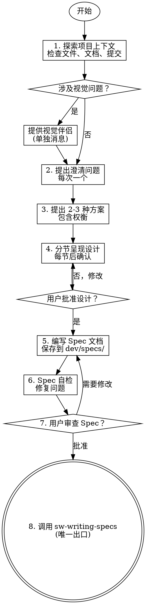

# Brainstorming - 头脑风暴与需求分析

将想法通过苏格拉底式对话转化为完整的设计和 Spec。

## 核心原则

**铁律：在呈现设计并获得用户批准之前，严禁：**
- 调用任何实现 Skill（如 sw-subagent-development）
- 编写任何代码
- 创建项目脚手架
- 执行任何实现动作

> **反模式警示**："这个太简单了，不需要设计"
> 
> 每个项目都要经过此流程。Todo 列表、单功能工具、配置修改——全部都要。"简单"项目是未经验证的假设造成最大浪费的地方。设计可以很短（几句话），但必须呈现并获得批准。

## 检查清单

必须按顺序完成以下任务：

- [ ] **探索项目上下文** — 检查文件、文档、最近提交
- [ ] **提出澄清问题** — 每次一个问题，理解目的/约束/成功标准
- [ ] **提出 2-3 种方案** — 包含权衡和你的推荐
- [ ] **分节呈现设计** — 按复杂度调整每节长度，每节后获得批准
- [ ] **编写 Spec 文档** — 保存到 `dev/specs/YYYY-MM-DD--<name>.md`
- [ ] **Spec 自检** — 检查占位符、矛盾、歧义、范围
- [ ] **用户审查 Spec** — 请用户审查书面 Spec
- [ ] **调用 sw-writing-specs** — 创建实现计划

## 流程图



## 详细流程

### 1. 探索项目上下文

开始提问前，先了解：
- 当前项目结构（`ls -la`, `tree`）
- 相关文档（README, AGENTS.md, 现有 Spec）
- 最近的 Git 提交历史
- 相关的现有代码

**范围评估**：如果请求描述多个独立子系统（如"构建包含聊天、文件存储、计费和分析的平台"），立即标记。不要花时间细化一个需要分解的项目的细节。

如果项目太大：
1. 帮助用户分解为子项目
2. 确定独立组件、依赖关系、构建顺序
3. 对第一个子项目执行正常的头脑风暴流程
4. 每个子项目有自己的 Spec → 计划 → 实现周期

### 2. 提出澄清问题

**规则**：
- 每次只能问一个问题
- 尽可能使用选择题，但开放式问题也可以
- 需要更多探索时，将主题分解为多个问题
- 关注：目的、约束、成功标准

**示例对话**：
```
你：这个功能的用户是谁？
用户：主要是我们的内部运营团队。

你：明白了。关于数据存储，你有偏好吗？
A) 继续使用现有的 PostgreSQL
B) 尝试新的 MongoDB
C) 外部服务（如 Firebase）

用户：选 A，保持 PostgreSQL。
```

### 3. 提出 2-3 种方案

探索方案时：
- 提出 2-3 种不同方法及其权衡
- 对话式呈现选项及你的推荐和理由
- 先呈现你的推荐选项并解释原因

### 4. 分节呈现设计

**一旦你理解了要构建的内容，分节呈现设计：**

- 每节长度根据复杂度调整：简单问题几句话，复杂问题 200-300 字
- 每节后询问"到目前为止看起来对吗？"
- 涵盖：架构、组件、数据流、错误处理、测试
- 如果某部分不合理，准备好回去澄清

**设计原则**：
- 将系统分解为更小单元，每个单元有明确目的，通过定义良好的接口通信，可独立理解和测试
- 对每个单元，能回答：它做什么？如何使用？依赖什么？
- 能否在不阅读内部实现的情况下理解单元功能？能否在不破坏使用者的情况下修改内部？如果不能，边界需要调整

**在现有代码库中工作**：
- 提出更改前先探索当前结构，遵循现有模式
- 现有代码存在影响工作的问题时（如文件过大、边界不清、职责纠缠），将针对性改进纳入设计——就像优秀开发者改进正在处理的代码一样
- 不要提出无关的重构，专注于服务当前目标的内容

### 5. 编写 Spec 文档

**文档规范**：
- 将验证后的设计保存到 `dev/specs/YYYY-MM-DD--<feature-name>.md`
- 使用 sw-brainstorming/templates/spec-template.md 模板
- 提交到 Git

### 6. Spec 自检

编写后，用新鲜视角审视：

1. **占位符扫描**：是否有 "TBD"、"TODO"、不完整部分或模糊需求？修复它们。
2. **内部一致性**：是否有部分相互矛盾？架构是否与功能描述匹配？
3. **范围检查**：这是否足够聚焦以制定单一实现计划，还是需要分解？
4. **歧义检查**：任何需求是否可能有两种不同解释？如果是，选择一种并明确说明。

发现问题就内联修复，无需重新审查——直接修复并继续。

### 7. 用户审查门控

自检通过后，请用户审查书面 Spec：

> "Spec 已编写并提交到 `dev/specs/YYYY-MM-DD--<name>.md`。请在继续制定实现计划前审查它，如有修改需求请告诉我。"

等待用户回复。如果他们请求修改，进行修改并重新运行 Spec 审查循环。只有用户批准后才继续。

### 8. 进入实现规划

**唯一出口**：调用 `sw-writing-specs` Skill 创建详细实现计划。

**严禁**：
- 调用 sw-subagent-development
- 调用 sw-test-driven-dev
- 直接开始编码

## 关键原则

| 原则 | 说明 |
|------|------|
| **一次一个问题** | 不要用多个问题压倒用户 |
| **优先选择题** | 比开放式问题更容易回答 |
| **YAGNI 无情** | 从所有设计中删除不必要的功能 |
| **探索替代方案** | 在确定前总是提出 2-3 种方法 |
| **增量验证** | 呈现设计，获得批准后再继续 |
| **保持灵活** | 某部分不合理时回去澄清 |

## 红旗 - 立即停止

| 想法 | 现实 |
|------|------|
| "用户大概会同意，先开始实现" | 未经明确批准，严禁开始实现。设计可以很短，但必须呈现并获批准 |
| "跳过 Spec 自检，看起来没问题" | 自检发现占位符、矛盾、歧义。跳过 = 有缺陷的 Spec |
| "不需要替代方案，我知道最佳方案" | 未呈现替代方案就确定设计 = 未经验证的假设。总是提出 2-3 种方法 |
| "把多个问题合并问更快" | 一次一个问题。合并会压倒用户，降低回答质量 |
| "编写 Spec 后立即开始编码" | 用户必须审查并批准 Spec。编码是唯一出口后的步骤 |

## 常见借口表

| 借口 | 现实 |
|------|------|
| "这个太简单了，不需要设计" | 简单项目是未经验证的假设造成最大浪费的地方。设计可以很短，但必须呈现并获批准 |
| "用户会同意我的设计" | 未经明确批准就开始实现 = 假设。假设是 bug 的来源 |
| "Spec 自检浪费时间" | 自检只需 2 分钟，发现的问题可能节省数小时返工 |
| "先写代码再补设计" | 设计先行是纪律。代码先行 = 即兴开发 |
| "问题太多用户会烦" | 每次一个问题比合并问题更快获得清晰答案 |

## YAGNI 原则

**You Aren't Gonna Need It**

对每个设计决策问：
- 这个功能现在需要吗？
- 可以稍后添加而不破坏现有代码吗？
- 这是假设的需求还是已确认的需求？

如果答案是不确定，删除它。

## 输出示例

**Spec 文件路径**: `dev/specs/2026-04-08--user-authentication.md`

**返回摘要格式**：
```markdown
## 头脑风暴完成

**Spec 文件**: `dev/specs/2026-04-08--user-authentication.md`
**设计状态**: ✅ 已批准
**主要决策**:
- 使用 JWT 进行身份验证
- 密码使用 bcrypt 哈希
- 支持邮箱+密码和 OAuth 两种方式

**下一步**: 调用 sw-writing-specs 创建实现计划
```

## 集成

**前置 Skill**: 无（这是工作流起点）

**后续 Skill**: 
- **sw-writing-specs** - 必须调用的下一个 Skill
- 严禁直接调用实现类 Skill

**相关 Skill**:
- sw-using-git-worktrees - 如需创建隔离工作区
