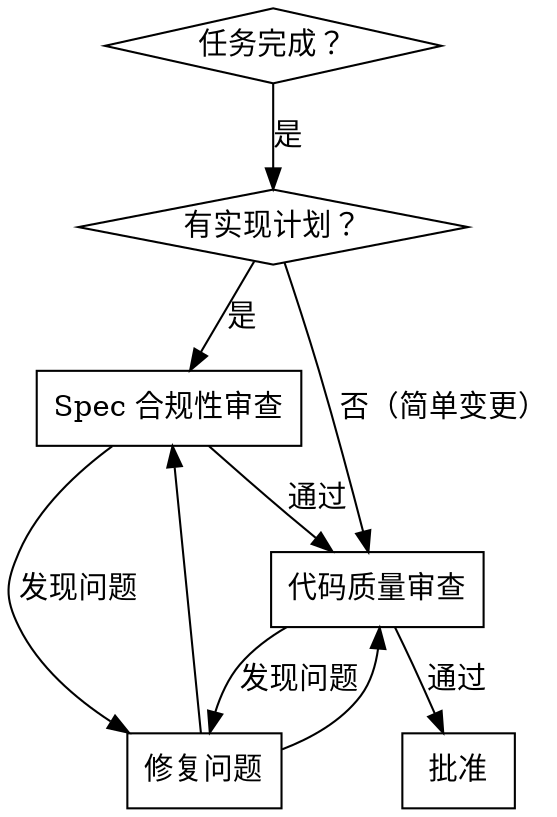
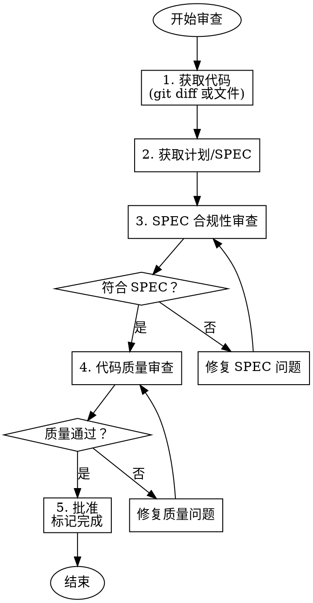

# Smart Router Code Review - 代码审查

在完成任何任务或功能后，对照计划和质量标准审查代码。

## 核心原则

**两阶段审查：**
1. **Spec 合规性审查** - 代码是否符合设计规范
2. **代码质量审查** - 代码是否高质量、可维护

**审查阻塞问题：** 严重问题必须修复后才能继续。

## 何时使用



## 审查流程



## 第一阶段：Spec 合规性审查

### 检查清单

- [ ] **功能完整** - 所有计划功能已实现
- [ ] **接口匹配** - 函数签名、参数、返回值符合设计
- [ ] **行为正确** - 实现的行为符合预期
- [ ] **无多余功能** - 未添加计划外的功能（YAGNI）
- [ ] **边界情况** - 计划中提到的边界情况已处理
- [ ] **错误处理** - 计划中要求的错误处理已实现

### Spec 合规性报告

**✅ 通过：**
```markdown
## Spec 合规性审查

**状态**: ✅ 通过
**代码**: `commit abc1234`

**评估**:
- ✅ 所有计划功能已实现
- ✅ 接口符合设计规范
- ✅ 行为正确
- ✅ 无多余功能

**结论**: 进入代码质量审查
```

**❌ 未通过：**
```markdown
## Spec 合规性审查

**状态**: ❌ 未通过
**代码**: `commit abc1234`

**问题**:
1. **[严重]** 缺失功能：用户权限验证未实现
   - 位置：`dev/auth/service.py:45`
   - 计划要求：第 3 任务要求验证用户权限
   - 实际：缺少权限检查

2. **[中等]** 接口不匹配：函数返回值类型错误
   - 位置：`dev/auth/models.py:23`
   - 计划要求：返回 `User | None`
   - 实际：返回 `dict`

**需要修复后重新审查**
```

## 第二阶段：代码质量审查

### 审查维度

#### 1. 代码风格

- [ ] 命名清晰（函数、变量、类名有意义）
- [ ] 代码格式一致
- [ ] 遵循项目编码规范

#### 2. 代码结构

- [ ] 函数大小合适（< 50 行）
- [ ] 职责单一（一个函数做一件事）
- [ ] 避免重复代码（DRY 原则）
- [ ] 合理的模块划分

#### 3. 可读性

- [ ] 逻辑清晰易懂
- [ ] 关键逻辑有中文注释
- [ ] 无魔法数字（使用常量）
- [ ] 代码自解释（好的命名胜过注释）

#### 4. 健壮性

- [ ] 错误处理完善
- [ ] 边界情况处理
- [ ] 无潜在 bug（空指针、越界等）
- [ ] 输入验证

#### 5. 测试质量

- [ ] 测试覆盖正常路径
- [ ] 测试覆盖错误路径
- [ ] 测试名称清晰描述场景
- [ ] 测试独立于实现细节
- [ ] 遵循 TDD（测试先失败再通过）

#### 6. 性能

- [ ] 无明显的性能问题
- [ ] 合理的算法复杂度
- [ ] 避免不必要的计算

### 代码质量报告

**✅ 通过：**
```markdown
## 代码质量审查

**状态**: ✅ 通过
**代码**: `commit abc1234`

**评估**:
- ✅ 命名清晰
- ✅ 结构合理
- ✅ 可读性良好
- ✅ 错误处理完善
- ✅ 测试覆盖充分

**建议**（非阻塞）:
- 可考虑将 `process_data` 拆分为两个函数（可选）

**结论**: 批准进入下一任务
```

**❌ 未通过：**
```markdown
## 代码质量审查

**状态**: ❌ 未通过
**代码**: `commit abc1234`

**问题**:
1. **[重要]** 函数过大
   - 位置：`dev/auth/service.py:23-89`
   - 问题：`login` 函数 66 行，职责过多
   - 建议：拆分为 `validate_credentials` 和 `create_session`

2. **[重要]** 魔法数字
   - 位置：`dev/auth/service.py:45`
   - 问题：`if retries > 3:` 中的 3
   - 建议：提取为常量 `MAX_RETRY = 3`

3. **[次要]** 缺少注释
   - 位置：`dev/auth/models.py:34`
   - 问题：密码哈希逻辑复杂但无注释
   - 建议：添加中文注释说明算法

**需要修复后重新审查**
```

## 问题严重级别

| 级别 | Spec 合规性 | 代码质量 |
|------|------------|----------|
| **严重** | 缺失必需功能、行为错误 | 可能导致 bug、安全漏洞 |
| **中等** | 部分实现、接口不匹配 | 影响可维护性、性能问题 |
| **轻微** | 多余功能、轻微偏差 | 风格问题、缺少注释 |

**阻塞规则**：严重和中等问题必须修复。

## 审查模板

### 函数审查检查清单

```markdown
### 函数: `<函数名>`

**位置**: `<文件路径>:<行号>`

**功能**: <函数做什么>

| 维度 | 状态 | 说明 |
|------|------|------|
| 命名 | ✅/❌ | <说明> |
| 大小 | ✅/❌ | <N 行> |
| 参数 | ✅/❌ | <参数合理吗> |
| 返回值 | ✅/❌ | <返回值清晰吗> |
| 错误处理 | ✅/❌ | <错误处理完善吗> |
| 测试覆盖 | ✅/❌ | <测试充分吗> |

**建议**: <改进建议>
```

### 类审查检查清单

```markdown
### 类: `<类名>`

**位置**: `<文件路径>`

**职责**: <类负责什么>

| 维度 | 状态 | 说明 |
|------|------|------|
| 命名 | ✅/❌ | <说明> |
| 职责单一 | ✅/❌ | <是否只做一件事> |
| 接口清晰 | ✅/❌ | <公开方法合理吗> |
| 封装 | ✅/❌ | <数据封装良好吗> |
| 测试覆盖 | ✅/❌ | <测试充分吗> |

**建议**: <改进建议>
```

## 审查输出

### 命令行摘要

```markdown
## 代码审查完成

**审查范围**: `dev/auth/`
**提交**: `abc1234`
**审查者**: sw-code-review Skill

### 结果统计
| 维度 | 通过 | 问题 |
|------|------|------|
| Spec 合规性 | ✅ | 0 |
| 代码风格 | ⚠️ | 2 轻微 |
| 代码结构 | ✅ | 0 |
| 可读性 | ⚠️ | 1 轻微 |
| 健壮性 | ✅ | 0 |
| 测试质量 | ✅ | 0 |

### 严重问题（需修复）
无

### 建议（可选）
1. 添加更多类型注解
2. 提取常量

### 结论
✅ **批准** - 可进入下一任务
```

## 红旗 - 审查失败

以下情况必须要求修复：

- 缺失计划中的功能
- 接口不符合设计
- 严重 bug 或安全漏洞
- 无测试或测试不充分
- 代码无法运行
- 违反项目编码规范

## 集成

**前置 Skill**: 
- sw-subagent-development（提供待审查代码）
- sw-writing-specs（提供审查标准）

**后续 Skill**: 
- sw-subagent-development（修复后重新审查）
- sw-finishing-branch（所有任务完成后）

**此 Skill 被调用时**:
- 每个任务完成后（在 subagent-development 内部）
- 整个功能完成后（最终审查）
- 用户要求代码审查时

## 最佳实践

1. **客观公正** - 基于规范，不是个人偏好
2. **建设性** - 提供具体改进建议
3. **优先级** - 关注严重问题，不过度追求完美
4. **一致性** - 对所有代码应用相同标准
5. **教育性** - 解释为什么某个模式更好

## 示例对话

**审查者发现严重问题**：
```
发现了以下需要修复的问题：

[严重] 缺失错误处理
位置：dev/auth/service.py:45
问题：数据库查询可能失败，但未处理异常
建议：添加 try-except 块处理 DatabaseError

请修复后，我将重新审查。
```

**审查者批准**：
```
✅ 代码审查通过

所有严重问题已解决，代码质量良好。
可以进入下一任务。
```
