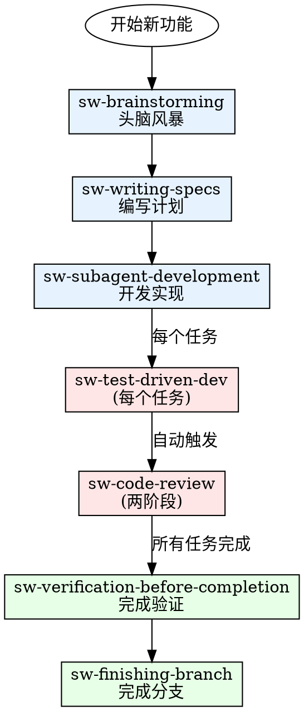

# Smart Router Development Workflow - 研发工作流指南

不确定该用哪个 Skill？这个 Skill 指导你完成完整的 Smart Router 开发工作流。

## 核心工作流



## 场景决策树

### 场景 1: 开始新功能

```
用户: "我想开发一个用户登录功能"

判断:
├── 有明确需求？
│   └── ✅ 使用 sw-brainstorming
│       └── "参考 sw-brainstorming Skill 帮我设计用户登录功能"
```

### 场景 2: 已有设计，准备开发

```
用户: "设计已完成，准备开发"

判断:
├── 有详细实现计划？
│   ├── ❌ 没有 → 使用 sw-writing-specs
│   │           └── "调用 sw-writing-specs 创建实现计划"
│   └── ✅ 有 → 使用 sw-subagent-development
│               └── "使用 sw-subagent-development 执行计划"
```

### 场景 3: 修复 Bug

```
用户: "修复登录失败的 Bug"

判断:
├── Bug 原因明确？
│   ├── ❌ 不明确 → 使用 sw-systematic-debugging
│   │               └── "使用 sw-systematic-debugging 调查 Bug"
│   └── ✅ 明确 → 使用 sw-test-driven-dev
│                   └── "使用 sw-test-driven-dev 修复 Bug"
```

### 场景 4: 代码审查

```
用户: "审查这段代码"

判断:
├── 对照 Spec 检查？
│   └── ✅ 使用 sw-code-review
│       └── "调用 sw-code-review Skill 审查代码"
```

## 完整工作流示例

### 示例 1: 从零开始开发功能

```
[1] 参考 sw-brainstorming Skill 分析需求
    ↓ 输出: dev/specs/active/2026-04-10--user-auth.md
    
[2] 调用 sw-writing-specs Skill 创建实现计划
    ↓ 输出: dev/specs/plans/2026-04-10--user-auth-plan.md
    
[3] 使用 sw-subagent-development Skill 执行计划
    ↓ 内部自动触发:
    ├── sw-test-driven-dev (每个任务)
    └── sw-code-review (两阶段审查)
    
[4] 调用 sw-verification-before-completion 验证
    ↓ 确认所有验收标准通过
    
[5] 使用 sw-finishing-branch Skill 完成分支
    ↓ 合并到 main
```

### 示例 2: 快速修复 Bug

```
[1] 使用 sw-systematic-debugging Skill 调查 Bug
    ↓ 找到根本原因
    
[2] 使用 sw-test-driven-dev Skill 修复
    ↓ RED-GREEN-REFACTOR
    
[3] 调用 sw-verification-before-completion 验证修复
    ↓ 确认 Bug 已修复
```

## Skill 速查表

| 场景 | 使用 Skill | 触发词 |
|------|-----------|--------|
| 开始新功能/设计 | sw-brainstorming | "设计..." "分析需求" |
| 创建实现计划 | sw-writing-specs | "创建计划" "制定计划" |
| 开发实现 | sw-subagent-development | "执行计划" "开发..." |
| 强制 TDD | sw-test-driven-dev | "TDD" "测试驱动" |
| 代码审查 | sw-code-review | "审查代码" "review" |
| 完成验证 | sw-verification-before-completion | "验证" "检查完成情况" |
| 完成分支 | sw-finishing-branch | "完成" "合并分支" |
| Bug 调查 | sw-systematic-debugging | "调查 Bug" "调试" |
| Git 工作区 | sw-using-git-worktrees | "worktree" "隔离开发" |
| 创建 Skill | sw-writing-skills | "创建 Skill" |

## 输出示例

### 工作流指导

```markdown
## Smart Router 研发工作流建议

**你的需求**: 开发用户认证功能

**推荐工作流**:

1. **设计阶段** (sw-brainstorming)
   > 参考 sw-brainstorming Skill 帮我设计用户认证功能

2. **计划阶段** (sw-writing-specs)
   > 调用 sw-writing-specs Skill 创建实现计划

3. **开发阶段** (sw-subagent-development)
   > 使用 sw-subagent-development Skill 执行计划
   
   注：此阶段会自动触发 TDD 和代码审查

4. **验证阶段** (sw-verification-before-completion)
   > 调用 sw-verification-before-completion 验证实现

5. **完成阶段** (sw-finishing-branch)
   > 使用 sw-finishing-branch Skill 完成分支

**预计时间**: 2-4 小时
**涉及文件**: dev/specs/, dev/scripts/
```

## 原则

1. **Skill 是独立的** - 每个 Skill 可以单独调用
2. **自动触发** - 不需要手动管理调用链
3. **灵活组合** - 根据实际需求选择使用哪些 Skill
4. **上下文感知** - Skill 会根据当前状态自动判断

## 总结

**不需要记住所有 Skill**，只需描述你的需求：

- "我要开发新功能" → 自动触发 brainstorming → writing-specs → subagent-development
- "我要修 Bug" → 自动触发 debugging → TDD

**直接说出你的需求，正确的 Skill 会自动匹配。**
