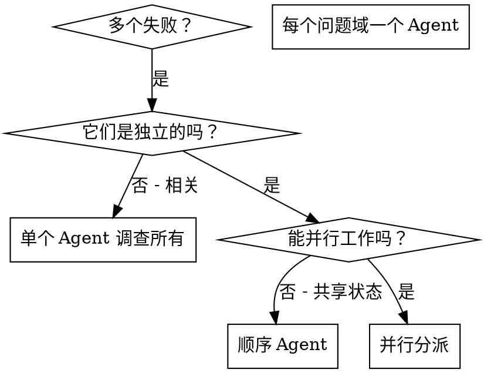

# 并行分派 Agent

## 概述

你将任务委派给具有隔离上下文的专业 Agent。通过精确设计他们的指令和上下文，确保他们保持专注并成功完成任务。他们不应继承你的会话上下文或历史——你构建他们需要的精确内容。这也为你保留了协调工作的上下文。

当你有多个不相关的失败（不同的测试文件、不同的子系统、不同的 Bug）时，顺序调查会浪费时间。每个调查都是独立的，可以并行发生。

**核心原则：** 每个独立问题域分派一个 Agent。让他们并发工作。

## 何时使用



**使用时机：**
- 3+ 个测试文件失败，根因不同
- 多个子系统独立损坏
- 每个问题无需其他问题的上下文即可理解
- 调查之间无共享状态

**不要使用：**
- 失败是相关的（修复一个可能修复其他）
- 需要理解完整系统状态
- Agent 会相互干扰

## 模式

### 1. 识别独立域

按损坏内容分组失败：
- 文件 A 测试：工具审批流程
- 文件 B 测试：批量完成行为
- 文件 C 测试：中止功能

每个域都是独立的——修复工具审批不会影响中止测试。

### 2. 创建聚焦的 Agent 任务

每个 Agent 获得：
- **明确范围：** 一个测试文件或子系统
- **清晰目标：** 让这些测试通过
- **约束：** 不要修改其他代码
- **预期输出：** 发现的问题和修复的摘要

### 3. 并行分派

```typescript
// 在 Claude Code / AI 环境中
Task("修复 agent-tool-abort.test.ts 失败")
Task("修复 batch-completion-behavior.test.ts 失败")
Task("修复 tool-approval-race-conditions.test.ts 失败")
// 三个同时运行
```

### 4. 审查和集成

Agent 返回时：
- 阅读每个摘要
- 验证修复不冲突
- 运行完整测试套件
- 集成所有更改

## Agent 提示结构

好的 Agent 提示：
1. **聚焦** - 一个清晰的问题域
2. **自包含** - 理解问题所需的全部上下文
3. **输出明确** - Agent 应该返回什么？

```markdown
修复 src/agents/agent-tool-abort.test.ts 中的 3 个失败测试：

1. "should abort tool with partial output capture" - 期望消息中包含 'interrupted at'
2. "should handle mixed completed and aborted tools" - 快速工具被中止而不是完成
3. "should properly track pendingToolCount" - 期望 3 个结果但得到 0

这些是时序/竞态条件问题。你的任务：

1. 阅读测试文件并理解每个测试验证的内容
2. 识别根本原因——时序问题还是实际 Bug？
3. 通过以下方式修复：
   - 用基于事件的等待替换任意超时
   - 如果发现中止实现中的 Bug，则修复
   - 如果测试行为已更改，调整测试期望

不要只是增加超时——找到真正的问题。

返回：你发现的问题和修复内容的摘要。
```

## 常见错误

**❌ 太宽泛：** "修复所有测试" - Agent 会迷失
**✅ 具体：** "修复 agent-tool-abort.test.ts" - 聚焦范围

**❌ 无上下文：** "修复竞态条件" - Agent 不知道在哪
**✅ 上下文：** 粘贴错误消息和测试名称

**❌ 无约束：** Agent 可能重构一切
**✅ 约束：** "不要修改生产代码" 或 "仅修复测试"

**❌ 输出模糊：** "修复它" - 你不知道改了什么
**✅ 具体：** "返回根本原因和更改的摘要"

## 红旗 - 停止并重新评估

| 想法 | 现实 |
|------|------|
| "这些失败看起来相关，但先并行吧" | 相关失败并行会浪费更多时间。先一起调查 |
| "Agent 会自己搞清楚范围" | 每个 Agent 需要明确的聚焦范围。模糊范围 = 迷失的 Agent |
| "不用检查冲突，应该不会" | 必须验证修复不冲突。一次冲突可能破坏代码库 |
| "修复看起来简单，不需要摘要" | 必须阅读每个摘要。你不知道改了什么 = 风险 |
| "给一个 Agent 所有问题更快" | 宽泛范围导致 Agent 迷失。聚焦才能快速 |

## 常见借口表

| 借口 | 现实 |
|------|------|
| "并行比顺序快，总是更好" | 相关失败并行会浪费更多时间 |
| "给一个 Agent 所有问题更快" | 宽泛范围导致 Agent 迷失，效率更低 |
| "冲突很少发生" | 一次冲突就可能破坏整个代码库 |
| "Agent 知道该返回什么" | 模糊的输出 = 你不知道改了什么 |
| "探索性调试也可以并行" | 不知道问题在哪时，并行是盲目搜索 |

## 何时不使用

**相关失败：** 修复一个可能修复其他——先一起调查
**需要完整上下文：** 理解需要看到整个系统
**探索性调试：** 你还不知道哪里坏了
**共享状态：** Agent 会干扰（编辑相同文件，使用相同资源）

## 会话中的真实示例

**场景：** 重大重构后 3 个文件中 6 个测试失败

**失败：**
- agent-tool-abort.test.ts: 3 个失败（时序问题）
- batch-completion-behavior.test.ts: 2 个失败（工具未执行）
- tool-approval-race-conditions.test.ts: 1 个失败（执行计数 = 0）

**决策：** 独立域——中止逻辑、批量完成、竞态条件互不相关

**分派：**
```
Agent 1 → 修复 agent-tool-abort.test.ts
Agent 2 → 修复 batch-completion-behavior.test.ts
Agent 3 → 修复 tool-approval-race-conditions.test.ts
```

**结果：**
- Agent 1：用基于事件的等待替换超时
- Agent 2：修复事件结构 Bug（threadId 位置错误）
- Agent 3：添加异步工具执行完成的等待

**集成：** 所有修复独立，无冲突，完整套件通过

**节省时间：** 3 个问题并行解决 vs 顺序解决

## 关键收益

1. **并行化** - 多个调查同时发生
2. **聚焦** - 每个 Agent 范围窄，需要跟踪的上下文更少
3. **独立性** - Agent 互不干扰
4. **速度** - 3 个问题用 1 个问题的时间解决

## 验证

Agent 返回后：
1. **审查每个摘要** - 理解改了什么
2. **检查冲突** - Agent 是否编辑了相同代码？
3. **运行完整套件** - 验证所有修复一起工作
4. **抽查** - Agent 可能犯系统性错误

## 实际影响

来自调试会话 (2025-10-03)：
- 3 个文件中 6 个失败
- 3 个 Agent 并行分派
- 所有调查并发完成
- 所有修复成功集成
- Agent 更改之间零冲突
