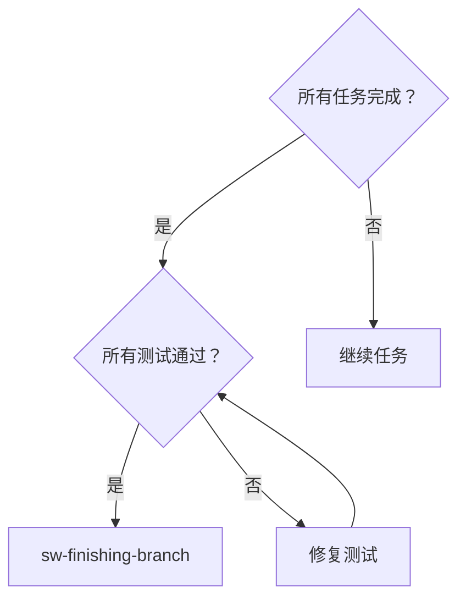
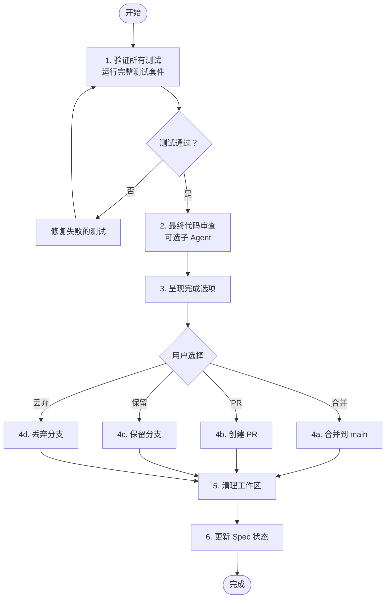

# Finishing Branch - 完成开发分支

所有任务完成后，验证、决策并清理开发分支。

## 核心原则

**完成 = 验证 + 决策 + 清理**

- 验证所有测试通过
- 呈现选项（合并/PR/保留/丢弃）
- 清理工作区

## 何时使用



## 完成流程



## 详细步骤

### 1. 验证所有测试

**运行完整测试套件**：

```bash
# Python
python -m pytest -v

# JavaScript
npm test

# 所有项目
make test  # 如果有
```

**验证要求**：
- [ ] 所有测试通过
- [ ] 无错误输出
- [ ] 无警告（或警告已记录并合理解释）
- [ ] 测试覆盖率符合项目要求

**如果测试失败**：
- 修复失败的测试
- 重新运行测试套件
- 重复直到全部通过

### 2. 最终代码审查（可选）

**分派最终审查子 Agent**：

```markdown
请审查整个实现：
- 对比原始 Spec 验证完整性
- 检查代码一致性
- 验证文档更新
- 确认无遗留问题
```

**审查检查清单**：
- [ ] 所有需求已实现
- [ ] 代码风格一致
- [ ] 文档已更新
- [ ] 无 TODO/FIXME 遗留
- [ ] 无调试代码

### 3. 呈现完成选项

向用户展示选项：

> ## 开发分支完成
> 
> **分支**: `feature/user-auth`
> **提交**: `abc1234`
> **测试状态**: ✅ 全部通过 (42/42)
> 
> ### 变更摘要
> - 新增文件: 8
> - 修改文件: 3
> - 删除文件: 0
> - 代码行数: +450/-120
> 
> ### 完成选项
> 
> **A) 合并到 main** [推荐]
> - 直接合并分支到 main
> - 删除开发分支
> - 清理工作区
> 
> **B) 创建 Pull Request**
> - 推送分支到远程
> - 创建 PR 供审查
> - 保留工作区等待合并
> 
> **C) 保留分支**
> - 保留分支和开发环境
> - 用于后续迭代
> 
> **D) 丢弃分支**
> - 删除分支和工作区
> - 保留代码变更（如有需要）
> 
> 请选择 (A/B/C/D)：

### 4. 执行用户选择

#### 选项 A: 合并到 main

```bash
# 切换到 main
git checkout main

# 合并分支
git merge feature/user-auth --no-ff -m "feat: user authentication

- Add User model with password hashing
- Implement login/logout functionality
- Add session management
- Add comprehensive tests

Closes #123"

# 推送
git push origin main

# 删除本地分支
git branch -d feature/user-auth

# 删除远程分支（如有）
git push origin --delete feature/user-auth
```

#### 选项 B: 创建 Pull Request

```bash
# 推送分支到远程
git push -u origin feature/user-auth

# 生成 PR 描述
```

**PR 描述模板**：
```markdown
## 描述
实现用户认证功能

## 变更
- 添加 User 模型
- 实现登录/登出
- 添加会话管理
- 添加测试

## 测试
- [x] 所有测试通过
- [x] 新增测试覆盖新功能

## Spec
关联: `docs/sw-superpower/specs/2026-04-08--user-auth.md`

## 审查清单
- [x] 代码遵循项目规范
- [x] 测试覆盖充分
- [x] 文档已更新
```

#### 选项 C: 保留分支

```bash
# 推送分支到远程（确保备份）
git push -u origin feature/user-auth

# 保留本地分支和工作区
```

告知用户：
> 分支已保留。当前在 `feature/user-auth` 分支。
> 如需继续开发，可直接在此分支工作。

#### 选项 D: 丢弃分支

```bash
# 切换到 main
git checkout main

# 删除本地分支
git branch -D feature/user-auth

# 删除远程分支（如有）
git push origin --delete feature/user-auth
```

**注意**：如果用户想要保留代码但丢弃分支，先创建补丁：
```bash
git diff main..feature/user-auth > feature.patch
git checkout main
git branch -D feature/user-auth
```

### 5. 清理工作区

**清理检查清单**：
- [ ] 无孤立进程
- [ ] 磁盘空间已释放

### 6. 更新 Spec 状态

**更新 Spec 文件**：

```yaml
# 在 docs/sw-superpower/specs/YYYY-MM-DD--feature.md 中

status: implemented  # 或 merged

implementation:
  # ... 原有内容
  
completion:
  completed_at: 2026-04-08
  completed_by: coder
  merge_commit: abc1234
  branch: feature/user-auth
  action: merged  # merged | pr | kept | discarded
```

**归档 Spec**：
```bash
# 如果项目有归档流程
git mv docs/sw-superpower/specs/active/YYYY-MM-DD--feature.md docs/sw-superpower/specs/archived/
git commit -m "docs: archive completed spec"
```

## 验证清单

完成前确认：

- [ ] 所有测试通过
- [ ] 无错误输出
- [ ] 用户已选择完成选项
- [ ] 选择已执行（合并/PR/保留/丢弃）
- [ ] 工作区已清理
- [ ] Spec 状态已更新
- [ ] 更改已提交/推送

## 输出示例

### 合并完成

```markdown
## 开发分支完成 - 已合并

**分支**: `feature/user-auth`
**操作**: 合并到 main
**合并提交**: `abc1234`
**时间**: 2026-04-08 14:30

### 变更统计
- 新增: 8 文件
- 修改: 3 文件
- 删除: 0 文件
- +450/-120 行

### 后续步骤
1. ✅ 分支已删除
2. ✅ Worktree 已清理
3. ✅ Spec 已归档
4. 🔄 CI/CD 正在运行 (https://ci.example.com/build/123)

### 相关资源
- Spec: `docs/sw-superpower/specs/archived/2026-04-08--user-auth.md`
- 提交: `abc1234`
```

### PR 创建完成

```markdown
## 开发分支完成 - PR 已创建

**分支**: `feature/user-auth`
**操作**: 创建 Pull Request
**PR**: #45 (https://github.com/username/repo/pull/45)

### PR 状态
- 状态: 🟡 等待审查
- 审查者: (待分配)
- CI: 🟢 通过

### 后续步骤
1. 分配审查者
2. 等待审查反馈
3. 根据反馈修改
4. 合并到 main

### 保留资源
- Spec: `docs/sw-superpower/specs/active/2026-04-08--user-auth.md`
```

## 集成

**前置 Skill**: 
- sw-subagent-development（完成所有任务）
- sw-code-review（最终审查）

**后续**: 无（工作流终点）

**相关 Skill**: 无

## 红旗 - 阻止完成

| 想法 | 现实 |
|------|------|
| "测试大部分通过了，可以完成" | 测试未通过 = 不应完成。所有测试必须通过 |
| "严重 bug 先记录，以后修复" | 严重 bug 未修复 = 不应完成。合并严重 bug = 污染 main |
| "用户大概想合并" | 用户未明确选择 = 不应完成。必须确认用户意图 |
| "文档可以以后更新" | 未完成文档更新 = 不应完成。文档是交付的一部分 |
| "工作区以后清理" | 未清理工作区 = 不应完成。清理是完成的组成部分 |

## 常见借口表

| 借口 | 现实 |
|------|------|
| "就剩一个测试失败，先完成" | 一个失败测试可能隐藏严重问题。所有测试必须通过 |
| "用户忙，我先合并" | 未经用户明确确认的合并可能违背用户意图 |
| "文档不重要，代码才重要" | 文档是维护和理解代码的基础。不完整的文档 = 不完整的功能 |
| "工作区不占多少空间" | 未清理的工作区积累会导致混乱和资源浪费 |
| "以后修 bug 比现在更快" | 已知 bug 合并到 main 后修复成本更高 |

## 最佳实践

1. **总是运行完整测试** - 不只是修改的测试
2. **明确用户意图** - 确认用户想要合并/PR/保留/丢弃
3. **备份重要工作** - 推送分支到远程再删除本地
4. **更新文档** - 完成时更新 Spec 和 README
5. **清理彻底** - 不遗留临时文件或孤立目录
