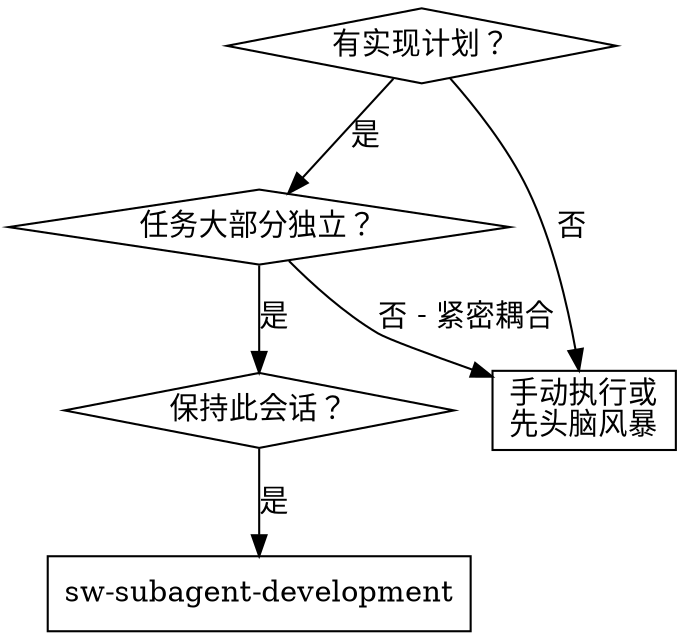
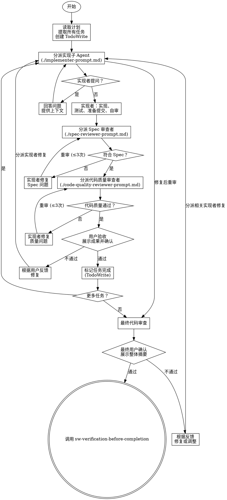

# Subagent-Driven Development - 子 Agent 驱动开发

通过为每个任务分派全新子 Agent 执行计划，每个任务后进行两阶段审查：Spec 合规性审查优先，代码质量审查其次。

## 为什么使用子 Agent

你委派任务给具有隔离上下文的专业 Agent。通过精确设计他们的指令和上下文，确保他们保持专注并成功完成任务。他们不应该继承你的会话上下文或历史——你构建他们需要的精确内容。这也为你保留了协调工作的上下文。

**核心原则**: 每个任务使用全新子 Agent + 两阶段审查（先 Spec 合规，后代码质量）= 高质量，快速迭代

## 何时使用



## 完整流程



## 执行检查清单

每个任务执行前快速确认：
- [ ] 读取计划文件并提取所有任务
- [ ] 为当前任务提供完整上下文（决策、代码摘要、未解决问题）
- [ ] 实现者严格遵循 RED→GREEN→REFACTOR
- [ ] 主 Agent 执行 `git commit`（每次提交前询问用户，子 Agent 只准备摘要）
- [ ] Spec 审查 → 代码质量审查 → **自动推进下一任务**（顺序不可变）
- [ ] 每轮审查最多 3 次迭代，超限上报用户
- [ ] 所有任务完成后自动调用 `sw-verification-before-completion`

## 详细步骤

### 1. 准备阶段

#### 1.1 Git 提交规则（**铁律**）

**严禁一次性授权自动提交。每次 `git commit` 和 `git push` 前都必须单独询问用户。**

**每次提交前必须**：
1. 向用户展示变更摘要（修改了哪些文件、关键变更、测试结果）
2. 请求明确允许：
   > "准备执行 `git commit -m '[提交信息]'`，变更摘要：[摘要]。是否允许提交？"
3. 只有用户明确回复"允许"、"提交"、"Yes"等肯定词后才执行

**每次推送前必须**：
1. 向用户展示推送摘要（分支、提交数、变更范围）
2. 请求明确允许：
   > "准备执行 `git push origin [分支]`，将推送 X 个提交。是否允许推送？"
3. 只有用户明确允许后才执行

> **注意**：用户说"好的"、"可以"、"OK"等模糊回应**不算**明确允许。必须追问："请明确回复'允许提交'或'不允许'。"

**读取计划文件**：
```bash
# 一次性读取完整计划
cat docs/sw-superpower/plans/YYYY-MM-DD--feature-plan.md
```

**提取任务**：
- 提取所有任务及其完整文本
- 记录每个任务的上下文需求
- 创建 TodoWrite 跟踪所有任务

### 2. 执行任务循环

对每个任务：

#### 2.1 分派实现子 Agent

**必须提供**：
- 完整任务文本（不是文件路径）
- 相关上下文（相关代码片段、接口定义）
- 项目结构信息
- 编码规范

**使用**: `./subagent-prompts/implementer-prompt.md`

#### 2.2 处理实现者提问与重新分派

如果实现子 Agent 提问：
- 清晰完整地回答
- 如需要，提供额外上下文
- 不要催促他们进入实现

**重新分派时必须传递上下文**：
OpenCode 子 Agent 每次分派都是全新上下文。重新分派实现者时，**必须**在提示中附带：
- 之前已做的技术决策（如"使用 JWT 而非 Session"）
- 已完成的代码摘要（关键函数/文件）
- 当前未解决的问题或待修复项
- 之前的问答记录（如有）

#### 2.3 实现者工作（强制 TDD）

实现子 Agent **必须**遵循 `sw-test-driven-dev`：
1. **编写测试** - 先写失败测试（RED）
2. **实现代码** - 写最简代码让测试通过（GREEN）
3. **重构** - 清理代码，保持测试通过（REFACTOR）
4. **准备提交** - 整理变更，准备提交摘要和变更说明（由主 Agent 执行实际 `git commit`）
5. **自我审查** - 对照检查清单

**严禁**：先写代码后补测试。这是红旗行为。

#### 2.3.5 主 Agent 执行提交

实现者只准备提交摘要，**不自行 `git commit`**。主 Agent 必须：
1. 审查实现者返回的变更摘要和测试报告
2. 确认无误后执行 `git commit -m "[建议提交信息]"`
3. 记录提交 SHA，供后续审查使用

#### 2.4 Spec 合规性审查（第一阶段）

**必须在此阶段之前**：
- 主 Agent 已完成 `git commit`，获取提交后的 git SHAs

**分派 Spec 审查者**：
- 提供原始任务描述
- 提供实现的代码（git diff 或文件）
- **提供当前审查轮次**（第 1/2/3 轮）

**使用**: `./subagent-prompts/spec-reviewer-prompt.md`

**审查迭代规则**：
- **最多 3 轮审查-修复循环**
- 第 1-2 轮未通过 → 实现者修复 → **主 Agent `git commit`** → 重新审查
- **第 3 轮仍未通过** → 停止循环，**上报用户**决策（继续修复 / 调整计划 / 重新设计）
- **绝不**无限循环

#### 2.5 代码质量审查（第二阶段）

**只有在 Spec 合规 ✅ 后才能开始**

**分派代码质量审查者**：
- 提供代码（git SHAs）
- 提供项目编码规范
- **提供当前审查轮次**（第 1/2/3 轮）

**使用**: `./subagent-prompts/code-quality-reviewer-prompt.md`

**审查迭代规则**（同 Spec 审查）：
- **最多 3 轮审查-修复循环**
- 第 3 轮仍未通过 → **上报用户**决策
- 代码质量严重问题可降级为 Spec 问题处理

#### 2.6 任务完成摘要

子 Agent 审查通过后，任务即视为完成。向用户展示任务摘要，然后**自动进入下一任务**：

**向用户展示**：
- 任务完成摘要（修改了哪些文件）
- 测试结果（通过/失败）
- 审查发现的问题及修复（如有）
- 提交 SHA（如已提交）

**自动推进模板**：
> "任务 X 已完成：
> - 修改文件：[文件列表]
> - 测试结果：X/Y 通过
> - 审查状态：Spec 合规 ✅，代码质量 ✅
> - 提交 SHA：[SHA]
>
> 自动进入下一任务。"

> **说明**：子 Agent 审查（Spec 合规 + 代码质量）是自动化质量门控。审查通过后自动推进，无需等待用户额外确认。用户如有问题可随时打断。

**如果用户主动提出修改需求**：
- 记录用户反馈的具体问题
- **分派实现者修复**：向实现者提供：
  - 用户反馈的问题清单（逐条）
  - 当前代码状态摘要（已修改的文件和关键函数）
  - 之前的所有技术决策
- 实现者修复完成后，主 Agent 执行 `git commit`（**每次提交前询问**）
- **判断修复后路径**：
  - **纯调整类修复**（命名、注释、格式、简单重构）→ **直接推进**
  - **需求/功能类修复**（接口变更、新增功能、逻辑修改）→ **回到 2.4 Spec 审查**（完整重新审查）
- **注意**：用户反馈的修复不占用 Spec/代码审查的 3 轮限额

### 3. 完成阶段

所有任务完成后：

#### 3.1 最终代码审查
分派最终代码审查者审查整个实现，确认跨任务一致性。

**使用**: `./subagent-prompts/final-reviewer-prompt.md`

**必须提供**：
- 完整计划文件内容
- 所有任务的原始描述列表
- 所有任务的实现摘要（修改的文件、关键函数、提交 SHA）
- 各任务的审查报告（如有迭代修复，记录修复内容）
- 整体提交历史

#### 3.2 完成阶段摘要

**向用户展示整体摘要**：
- 完成的任务列表
- 关键修改文件
- 测试覆盖率概况
- 审查中发现并修复的问题统计
- 提交历史

**自动调用验证**：
> "所有任务已完成，整体审查通过。
> - 完成任务：X 个
> - 关键修改：[文件列表]
> - 审查迭代：X 次
> - 提交记录：[SHA 列表]
>
> 自动调用 `sw-verification-before-completion` 进行最终验证。"

展示摘要后**自动调用 `sw-verification-before-completion`**，无需等待用户回复。

- **如果用户主动提出跨任务问题**：
  - 记录反馈，确定涉及哪些任务
  - **分派相关实现者修复**跨任务问题：
    - 向每个涉及的实现者提供：用户反馈、当前代码状态、跨任务上下文（如接口不匹配的另一端）
    - 如涉及多个任务，依次修复
  - 主 Agent 执行各任务的 `git commit`（**每次提交前询问**）
  - 修复完成后**重新进行最终审查**（回到 3.1）
- **正常流程**：自动调用 `sw-verification-before-completion` Skill

## 实现者状态处理

实现子 Agent 报告四种状态之一。适当处理：

| 状态 | 含义 | 处理 |
|------|------|------|
| **DONE** | 完成 | 进入 Spec 合规性审查 |
| **DONE_WITH_CONCERNS** | 完成但有疑虑 | 阅读疑虑。如果是正确性或范围问题，审查前解决。如果是观察（如"文件变大了"），记录并进入审查。 |
| **NEEDS_CONTEXT** | 需要信息 | 提供缺失的上下文并重新分派。 |
| **BLOCKED** | 无法完成 | 评估阻塞原因：<br>1. 上下文问题 → 提供更多上下文，用相同模型重新分派<br>2. 需要更多推理 → 用更强模型重新分派<br>3. 任务太大 → 拆分为更小任务<br>4. 计划错误 → 上报给用户 |

**绝不**忽视升级或强制相同模型在没有改变的情况下重试。

## 模型选择

使用能处理每个角色的最弱模型以节省成本并提高速度。

| 任务类型 | 推荐 | 说明 |
|----------|------|------|
| 机械实现任务 | 快速、便宜模型 | 独立函数、清晰 Spec、1-2 文件 |
| 集成和判断任务 | 标准模型 | 多文件协调、模式匹配、调试 |
| 架构、设计、审查任务 | 最强可用模型 | 需要广泛理解 |

**任务复杂度信号：**
- 触及 1-2 文件，完整 Spec → 便宜模型
- 触及多文件，集成问题 → 标准模型
- 需要设计判断或广泛代码库理解 → 最强模型

## 红旗 - 严禁

| 想法 | 现实 |
|------|------|
| "跳过审查，节省时间" | 跳过任何审查（Spec 合规或代码质量）= 接受未验证的代码 |
| "同时分派多个实现子 Agent" | 并行分派多个实现子 Agent 会导致冲突。顺序执行 |
| "让子 Agent 自己读计划" | 子 Agent 不应读取计划文件。你应提供完整任务文本和上下文 |
| "差不多合规就行" | 接受 Spec 合规的"差不多" = 未完成。发现问题 = 必须修复 |
| "在 Spec 合规前开始代码质量审查" | **在 Spec 合规 ✅ 之前开始代码质量审查** = 顺序错误。先合规，后质量 |
| "审查有问题但先继续下一任务" | 任一审查有未解决问题时进入下一任务 = 积累技术债务 |
| "实现者自审就够了" | 让实现者自审替代实际审查 = 遗漏盲点。两者都需要 |
| "跳过重新审查，直接继续" | 跳过审查循环 = 修复可能无效。重新审查是必需的 |
| "子 Agent 的问题可以忽略" | 忽视子 Agent 提问 = 遗漏关键上下文。清晰完整地回答 |
| "先实现后补测试" | 先写代码后补测试 = 不是 TDD。必须 RED→GREEN→REFACTOR |
| "审查循环超过 3 次还继续" | 超过 3 轮未通过 = 计划或能力问题。必须上报用户 |
| "子 Agent 审查通过就跳过质量检查" | 审查循环（最多 3 轮）是自动化质量门控，必须严格执行 |
| "重新分派不带上下文" | 重新分派不带历史决策 = 重复工作、决策反复。必须传递上下文 |

## 常见借口表

| 借口 | 现实 |
|------|------|
| "审查浪费时间" | 审查防止问题复合。10 分钟审查可能节省数小时调试 |
| "Spec 合规只是形式主义" | Spec 合规防止过度/不足构建。不是形式，是质量控制 |
| "重新审查太繁琐" | 不重新审查 = 不知道修复是否有效。这是验证步骤 |
| "实现者自审就够了" | 自审有盲点。独立审查发现不同问题 |
| "子 Agent 问题太多，直接让它做" | 子 Agent 提问意味着上下文不足。回答前让它继续 = 错误实现 |
| "跳过审查循环节省时间" | 跳过审查 = 接受未验证代码。最多 3 轮审查循环不可省略 |
| "审查循环 3 次限制太死板" | 超过 3 次 = 根因未解决。上报用户调整计划比盲目修复更高效 |
| "重新分派带上下文太啰嗦" | 不带上下文 = 重复问答、重复工作、决策反复。更浪费 |

**如果子 Agent 提问：**
- 清晰完整地回答
- 如需要，提供额外上下文
- 不要催促他们进入实现

**如果审查者发现问题：**
- 实现者（相同子 Agent）修复
- 主 Agent `git commit`（如需要用户确认，先获得批准）
- 审查者重新审查
- 重复直到批准，或达到 3 轮上限（超限上报用户，见下方模板）
- 不要跳过重新审查

**如果审查循环超过 3 轮仍未通过（上报用户）：**

使用以下模板向用户汇报：
```markdown
## 需要您决策

**任务**: X - [任务名称]
**问题**: [Spec 审查 / 代码质量审查] 经过 3 轮修复仍未通过

**当前状态**:
- 已尝试的修复: [列举]
- 仍存在的问题: [列举]
- 审查者建议: [如有]

**选项**:
A) **继续修复** - 我尝试另一种修复方式（重置为第 1 轮审查，使用新的修复策略）
B) **调整计划** - 当前计划可能过于乐观，需要调整任务范围
C) **重新设计** - 回退到 `sw-brainstorming` 重新思考方案
D) **接受当前状态** - 您确认现有实现已足够（记录技术债务）

**选项说明**：
- 选 A：回到第 1 轮重新审查（不累计之前的 3 轮），尝试不同的修复方式
- 选 B：修改当前任务的范围或要求，可能拆分任务
- 选 C：放弃当前实现，回到 `sw-brainstorming` 重新设计
- 选 D：以当前状态结束，记录已知问题作为技术债务

请回复 A/B/C/D 或您的具体指示。
```

**如果子 Agent 任务失败：**
- 用具体指令分派修复子 Agent
- 不要尝试手动修复（上下文污染）

## 优势

**vs. 手动执行：**
- 子 Agent 自然遵循 TDD
- 每个任务全新上下文（无混淆）
- 并行安全（子 Agent 不干扰）
- 子 Agent 可以提问（工作前和工作中）

**vs. 批量执行：**
- 同一会话（无交接）
- 持续进展（无等待）
- 审查检查点自动

**效率提升：**
- 无文件读取开销（控制器提供完整文本）
- 控制器策划确切需要什么上下文
- 子 Agent 预先获得完整信息
- 工作前浮现问题（不是之后）

**质量门控：**
- 交接前自审捕获问题
- 两阶段审查：Spec 合规，然后代码质量
- 审查循环确保修复实际工作
- Spec 合规防止过度/不足构建
- 代码质量确保实现构建良好

## 集成

**必需工作流 Skill：**
- **sw-writing-specs** - 创建此 Skill 执行的计划
- **sw-verification-before-completion** - 所有任务完成后验证并标记完成

**子 Agent 应使用：**
- **sw-test-driven-dev** - 子 Agent 对每个任务遵循 TDD

## 示例工作流

```
你: 我使用子 Agent 驱动开发执行此计划。

[读取计划文件: docs/sw-superpower/plans/2026-04-08--auth-plan.md]
[提取所有 5 个任务及其完整文本和上下文]
[创建 TodoWrite 包含所有任务]

任务 1: 用户登录 API

[获取任务 1 文本和上下文（已提取）]
[分派实现子 Agent 包含完整任务文本 + 上下文]

实现者: "开始前 - 应该在用户还是系统级别安装？"

你: "用户级别 (~/.config/myapp/)"

实现者: "明白了。正在实现..."
[稍后] 实现者:
 - 实现登录 API
 - 添加测试，5/5 通过
 - 自审：发现漏了 --force 标志，已添加
 - 已准备提交，等待主 Agent 统一 commit

[主 Agent 执行 git commit -m "feat: 添加用户登录 API"]

[分派 Spec 合规性审查者]
Spec 审查者: ✅ Spec 合规 - 所有需求满足，无多余

[获取 git SHAs，分派代码质量审查者]
代码审查者: 优点：良好测试覆盖，简洁。问题：无。批准。

[任务完成摘要]
你: "任务 1 已完成：实现登录 API，测试 5/5 通过，审查无问题。自动进入下一任务。"

[标记任务 1 完成]

任务 2: JWT Token 生成

[获取任务 2 文本和上下文（已提取）]
[分派实现子 Agent 包含完整任务文本 + 上下文]

实现者: [无问题，继续]
实现者:
 - 添加 JWT 生成
 - 8/8 测试通过
 - 自审：一切良好
 - 已准备提交，等待主 Agent 统一 commit

[主 Agent 执行 git commit -m "feat: 添加 JWT Token 生成"]

[分派 Spec 合规性审查者]
Spec 审查者: ❌ 问题:
  - 缺失：Token 过期处理（Spec 说"支持过期"）
  - 多余：添加了 `--json` 标志（未请求）

[实现者修复问题]
实现者: 移除 --json 标志，添加过期处理

[主 Agent 执行 git commit -m "fix: JWT 过期处理和移除多余标志"]

[Spec 审查者重新审查]
Spec 审查者: ✅ 现在 Spec 合规

[分派代码质量审查者]
代码审查者: 优点：可靠。问题（重要）：魔法数字（3600）

[实现者修复]
实现者: 提取 JWT_EXPIRY 常量

[主 Agent 执行 git commit -m "refactor: 提取 JWT_EXPIRY 常量"]

[代码审查者重新审查]
代码审查者: ✅ 批准

[任务完成摘要]
你: "任务 2 已完成：添加 JWT 生成，修复了过期处理和多余标志，测试 8/8 通过。自动进入下一任务。"

[标记任务 2 完成]

...

[所有任务后]
[分派最终代码审查者]
最终审查者: 所有需求满足，准备合并

[完成阶段摘要]
你: "所有 5 个任务已完成。整体审查通过。自动调用 sw-verification-before-completion 进行最终验证。"

[自动调用 sw-verification-before-completion]

完成！
```

## 输出示例

**完成摘要格式**：
```markdown
## 子 Agent 驱动开发完成

**计划文件**: `docs/sw-superpower/plans/2026-04-08--auth-plan.md`
**任务数**: 5
**完成**: 5/5

### 审查统计
| 任务 | Spec 审查 | 代码审查 | 用户验收 | 迭代次数 |
|------|----------|----------|----------|---------|
| 1 | ✅ | ✅ | ✅ | 1 |
| 2 | ✅ (1 修复) | ✅ (1 修复) | ✅ | 2 |
| 3 | ✅ | ✅ | ✅ | 1 |
| 4 | ✅ | ✅ (2 修复) | ✅ | 2 |
| 5 | ✅ | ✅ | ✅ | 1 |

### 提交记录（由主 Agent 统一执行）
- `abc1234`: 任务 1 - 用户登录 API
- `def5678`: 任务 2 - JWT Token 生成
- ...

### 下一步
调用 sw-verification-before-completion 标记完成
```
