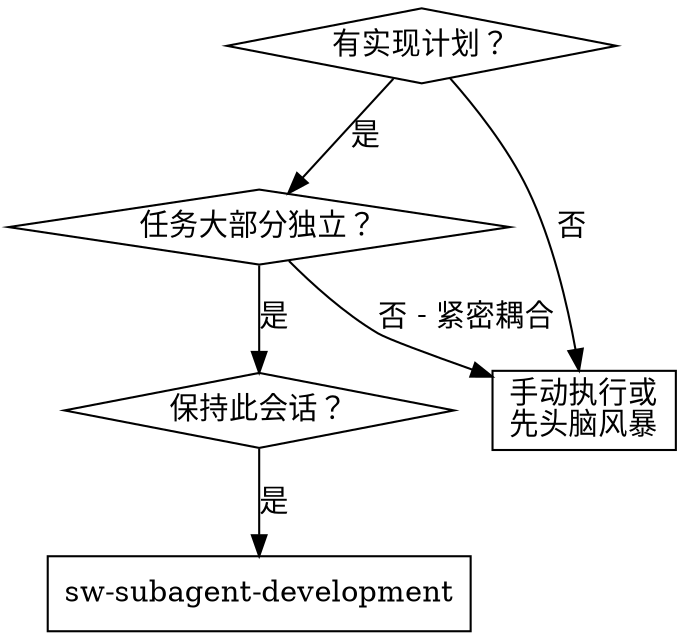
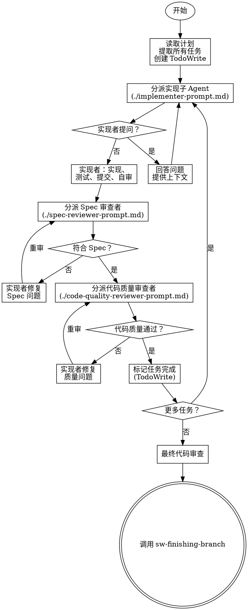

# Subagent-Driven Development - 子 Agent 驱动开发

通过为每个任务分派全新子 Agent 执行计划，每个任务后进行两阶段审查：Spec 合规性审查优先，代码质量审查其次。

## 为什么使用子 Agent

你委派任务给具有隔离上下文的专业 Agent。通过精确设计他们的指令和上下文，确保他们保持专注并成功完成任务。他们不应该继承你的会话上下文或历史——你构建他们需要的精确内容。这也为你保留了协调工作的上下文。

**核心原则**: 每个任务使用全新子 Agent + 两阶段审查（先 Spec 合规，后代码质量）= 高质量，快速迭代

## 何时使用



## 完整流程



## 详细步骤

### 1. 准备阶段

**读取计划文件**：
```bash
# 一次性读取完整计划
cat docs/sw-superpower/specs/YYYY-MM-DD--feature.md
```

**提取任务**：
- 提取所有任务及其完整文本
- 记录每个任务的上下文需求
- 创建 TodoWrite 跟踪所有任务

### 2. 执行任务循环

对每个任务：

#### 2.1 分派实现子 Agent

**必须提供**：
- 完整任务文本（不是文件路径）
- 相关上下文（相关代码片段、接口定义）
- 项目结构信息
- 编码规范

**使用**: `./subagent-prompts/implementer-prompt.md`

#### 2.2 处理实现者提问

如果实现子 Agent 提问：
- 清晰完整地回答
- 如需要，提供额外上下文
- 不要催促他们进入实现

#### 2.3 实现者工作

实现子 Agent 应该：
- 实现功能
- 编写测试（遵循 sw-test-driven-dev）
- 提交代码
- 自我审查

#### 2.4 Spec 合规性审查（第一阶段）

**必须在此阶段之前**：
- 获取实现提交后的 git SHAs

**分派 Spec 审查者**：
- 提供原始任务描述
- 提供实现的代码（git diff 或文件）

**使用**: `./subagent-prompts/spec-reviewer-prompt.md`

**如果发现问题**：
- 实现者修复
- 重新审查
- 重复直到 ✅

#### 2.5 代码质量审查（第二阶段）

**只有在 Spec 合规 ✅ 后才能开始**

**分派代码质量审查者**：
- 提供代码（git SHAs）
- 提供项目编码规范

**使用**: `./subagent-prompts/code-quality-reviewer-prompt.md`

**如果发现问题**：
- 实现者修复
- 重新审查
- 重复直到 ✅

#### 2.6 标记完成

更新 TodoWrite 标记任务完成。

### 3. 完成阶段

所有任务完成后：
1. 分派最终代码审查者审查整个实现
2. 调用 `sw-finishing-branch` Skill

## 实现者状态处理

实现子 Agent 报告四种状态之一。适当处理：

| 状态 | 含义 | 处理 |
|------|------|------|
| **DONE** | 完成 | 进入 Spec 合规性审查 |
| **DONE_WITH_CONCERNS** | 完成但有疑虑 | 阅读疑虑。如果是正确性或范围问题，审查前解决。如果是观察（如"文件变大了"），记录并进入审查。 |
| **NEEDS_CONTEXT** | 需要信息 | 提供缺失的上下文并重新分派。 |
| **BLOCKED** | 无法完成 | 评估阻塞原因：<br>1. 上下文问题 → 提供更多上下文，用相同模型重新分派<br>2. 需要更多推理 → 用更强模型重新分派<br>3. 任务太大 → 拆分为更小任务<br>4. 计划错误 → 上报给用户 |

**绝不**忽视升级或强制相同模型在没有改变的情况下重试。

## 模型选择

使用能处理每个角色的最弱模型以节省成本并提高速度。

| 任务类型 | 推荐 | 说明 |
|----------|------|------|
| 机械实现任务 | 快速、便宜模型 | 独立函数、清晰 Spec、1-2 文件 |
| 集成和判断任务 | 标准模型 | 多文件协调、模式匹配、调试 |
| 架构、设计、审查任务 | 最强可用模型 | 需要广泛理解 |

**任务复杂度信号：**
- 触及 1-2 文件，完整 Spec → 便宜模型
- 触及多文件，集成问题 → 标准模型
- 需要设计判断或广泛代码库理解 → 最强模型

## 红旗 - 严禁

| 想法 | 现实 |
|------|------|
| "跳过审查，节省时间" | 跳过任何审查（Spec 合规或代码质量）= 接受未验证的代码 |
| "同时分派多个实现子 Agent" | 并行分派多个实现子 Agent 会导致冲突。顺序执行 |
| "让子 Agent 自己读计划" | 子 Agent 不应读取计划文件。你应提供完整任务文本和上下文 |
| "差不多合规就行" | 接受 Spec 合规的"差不多" = 未完成。发现问题 = 必须修复 |
| "在 Spec 合规前开始代码质量审查" | **在 Spec 合规 ✅ 之前开始代码质量审查** = 顺序错误。先合规，后质量 |
| "审查有问题但先继续下一任务" | 任一审查有未解决问题时进入下一任务 = 积累技术债务 |
| "实现者自审就够了" | 让实现者自审替代实际审查 = 遗漏盲点。两者都需要 |
| "跳过重新审查，直接继续" | 跳过审查循环 = 修复可能无效。重新审查是必需的 |
| "子 Agent 的问题可以忽略" | 忽视子 Agent 提问 = 遗漏关键上下文。清晰完整地回答 |

## 常见借口表

| 借口 | 现实 |
|------|------|
| "审查浪费时间" | 审查防止问题复合。10 分钟审查可能节省数小时调试 |
| "Spec 合规只是形式主义" | Spec 合规防止过度/不足构建。不是形式，是质量控制 |
| "重新审查太繁琐" | 不重新审查 = 不知道修复是否有效。这是验证步骤 |
| "实现者自审就够了" | 自审有盲点。独立审查发现不同问题 |
| "子 Agent 问题太多，直接让它做" | 子 Agent 提问意味着上下文不足。回答前让它继续 = 错误实现 |

**如果子 Agent 提问：**
- 清晰完整地回答
- 如需要，提供额外上下文
- 不要催促他们进入实现

**如果审查者发现问题：**
- 实现者（相同子 Agent）修复
- 审查者重新审查
- 重复直到批准
- 不要跳过重新审查

**如果子 Agent 任务失败：**
- 用具体指令分派修复子 Agent
- 不要尝试手动修复（上下文污染）

## 优势

**vs. 手动执行：**
- 子 Agent 自然遵循 TDD
- 每个任务全新上下文（无混淆）
- 并行安全（子 Agent 不干扰）
- 子 Agent 可以提问（工作前和工作中）

**vs. 批量执行：**
- 同一会话（无交接）
- 持续进展（无等待）
- 审查检查点自动

**效率提升：**
- 无文件读取开销（控制器提供完整文本）
- 控制器策划确切需要什么上下文
- 子 Agent 预先获得完整信息
- 工作前浮现问题（不是之后）

**质量门控：**
- 交接前自审捕获问题
- 两阶段审查：Spec 合规，然后代码质量
- 审查循环确保修复实际工作
- Spec 合规防止过度/不足构建
- 代码质量确保实现构建良好

## 集成

**必需工作流 Skill：**
- **sw-writing-specs** - 创建此 Skill 执行的计划
- **sw-code-review** - 审查者子 Agent 的代码审查模板
- **sw-finishing-branch** - 所有任务完成后完成开发

**子 Agent 应使用：**
- **sw-test-driven-dev** - 子 Agent 对每个任务遵循 TDD

## 示例工作流

```
你: 我使用子 Agent 驱动开发执行此计划。

[读取计划文件: docs/sw-superpower/specs/2026-04-08--auth.md]
[提取所有 5 个任务及其完整文本和上下文]
[创建 TodoWrite 包含所有任务]

任务 1: 用户登录 API

[获取任务 1 文本和上下文（已提取）]
[分派实现子 Agent 包含完整任务文本 + 上下文]

实现者: "开始前 - 应该在用户还是系统级别安装？"

你: "用户级别 (~/.config/myapp/)"

实现者: "明白了。正在实现..."
[稍后] 实现者:
 - 实现登录 API
 - 添加测试，5/5 通过
 - 自审：发现漏了 --force 标志，已添加
 - 已提交

[分派 Spec 合规性审查者]
Spec 审查者: ✅ Spec 合规 - 所有需求满足，无多余

[获取 git SHAs，分派代码质量审查者]
代码审查者: 优点：良好测试覆盖，简洁。问题：无。批准。

[标记任务 1 完成]

任务 2: JWT Token 生成

[获取任务 2 文本和上下文（已提取）]
[分派实现子 Agent 包含完整任务文本 + 上下文]

实现者: [无问题，继续]
实现者:
 - 添加 JWT 生成
 - 8/8 测试通过
 - 自审：一切良好
 - 已提交

[分派 Spec 合规性审查者]
Spec 审查者: ❌ 问题:
 - 缺失：Token 过期处理（Spec 说"支持过期"）
 - 多余：添加了 --json 标志（未请求）

[实现者修复问题]
实现者: 移除 --json 标志，添加过期处理

[Spec 审查者重新审查]
Spec 审查者: ✅ 现在 Spec 合规

[分派代码质量审查者]
代码审查者: 优点：可靠。问题（重要）：魔法数字（3600）

[实现者修复]
实现者: 提取 JWT_EXPIRY 常量

[代码审查者重新审查]
代码审查者: ✅ 批准

[标记任务 2 完成]

...

[所有任务后]
[分派最终代码审查者]
最终审查者: 所有需求满足，准备合并

完成！
```

## 输出示例

**完成摘要格式**：
```markdown
## 子 Agent 驱动开发完成

**计划文件**: `docs/sw-superpower/specs/2026-04-08--auth.md`
**任务数**: 5
**完成**: 5/5

### 审查统计
| 任务 | Spec 审查 | 代码审查 | 迭代次数 |
|------|----------|----------|---------|
| 1 | ✅ | ✅ | 1 |
| 2 | ✅ (1 修复) | ✅ (1 修复) | 2 |
| 3 | ✅ | ✅ | 1 |
| 4 | ✅ | ✅ (2 修复) | 2 |
| 5 | ✅ | ✅ | 1 |

### 提交记录
- `abc1234`: 任务 1 - 用户登录 API
- `def5678`: 任务 2 - JWT Token 生成
- ...

### 下一步
调用 sw-finishing-branch 完成开发分支
```
