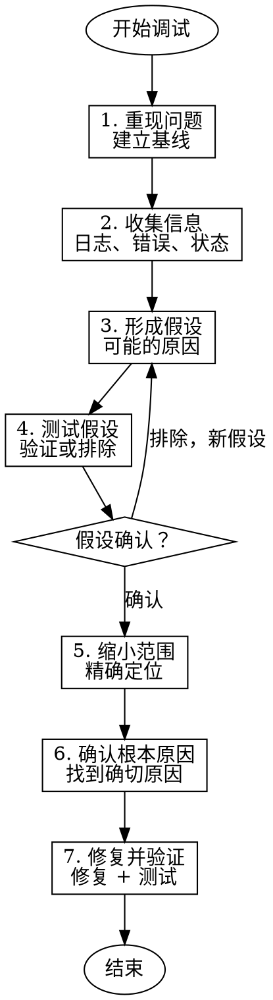

# Systematic Debugging - 系统化调试

使用系统化方法调查 bug、测试失败或意外行为，找到根本原因。

## 核心原则

**系统化 > 猜测**

- 基于证据，不是假设
- 分阶段缩小范围
- 验证每个假设
- 修复前确认根本原因

## 何时使用


## 调试流程



## 四阶段调试法

### 阶段 1: 重现问题

**建立稳定基线：**

- [ ] 问题可以稳定重现
- [ ] 记录重现步骤
- [ ] 记录环境信息（OS、版本、配置）
- [ ] 确定问题范围（输入、输出、边界）

**环境信息清单：**
```markdown
## 问题环境

**系统**: macOS 14.x / Ubuntu 22.04
**Python**: 3.11.x
**相关库版本**:
- xxx: 1.2.3
- yyy: 4.5.6

**重现步骤**:
1. 步骤 1
2. 步骤 2
3. 步骤 3

**预期结果**: xxx
**实际结果**: yyy
```

### 阶段 2: 收集信息

**收集证据：**

1. **错误信息**
   - 完整错误堆栈
   - 错误码和消息
   - 日志文件

2. **系统状态**
   - 变量值
   - 配置文件
   - 数据库状态

3. **时间线**
   - 何时开始出现问题
   - 最近的变更
   - 相关提交

**信息收集命令：**

```bash
# 查看日志
tail -f /var/log/app.log

# 查看最近提交
git log --oneline -20

# 查看文件变更
git diff HEAD~5

# 查看环境
pip list | grep xxx
python --version
```

### 阶段 3: 形成和测试假设

**形成假设：**

列出可能的原因（按概率排序）：
1. 最近代码变更
2. 依赖版本变化
3. 配置错误
4. 数据问题
5. 环境问题

**测试假设：**

对每个假设：
- [ ] 设计验证实验
- [ ] 执行实验
- [ ] 记录结果
- [ ] 确认或排除

**假设测试表：**

| 假设 | 验证方法 | 结果 | 结论 |
|------|---------|------|------|
| 最近提交引入 | git bisect | 问题在 commit abc123 | ✅ 确认 |
| 依赖版本问题 | 降级测试 | 问题依旧 | ❌ 排除 |
| 配置错误 | 对比配置 | 发现差异 | ✅ 确认 |

### 阶段 4: 缩小范围和确认根本原因

**缩小范围：**

使用二分法缩小问题范围：

```
1. 确定问题出现的范围
2. 检查中间点
3. 根据结果缩小到一半
4. 重复直到找到精确位置
```

**代码级别调试：**

```python
# 添加日志点
import logging
logging.debug(f"变量值: {variable}")

# 或使用 pdb
import pdb; pdb.set_trace()

# 或使用 print（临时）
print(f"DEBUG: 执行到这里，x = {x}")
```

**根本原因确认：**

在修复前，必须能回答：
- [ ] 为什么会发生这个问题？
- [ ] 这个解释能说明所有观察到的现象吗？
- [ ] 能预测在其他情况下是否会重现吗？

## 调试技术

### 1. 日志分析

**添加日志：**
```python
import logging

logging.basicConfig(level=logging.DEBUG)
logger = logging.getLogger(__name__)

logger.debug("进入函数 process_data")
logger.debug(f"输入参数: {data}")
logger.debug(f"处理结果: {result}")
```

**日志级别：**
- DEBUG: 详细信息
- INFO: 一般信息
- WARNING: 警告
- ERROR: 错误
- CRITICAL: 严重错误

### 2. 断点调试

**使用 pdb：**
```python
import pdb

def problematic_function():
    x = 1
    y = 2
    pdb.set_trace()  # 断点
    z = x + y
    return z
```

**pdb 命令：**
- `n` - 下一行
- `s` - 进入函数
- `c` - 继续执行
- `p <var>` - 打印变量
- `l` - 显示代码
- `q` - 退出

### 3. 二分法定位

**Git bisect：**
```bash
# 开始二分
git bisect start

# 标记当前有问题的提交
git bisect bad

# 标记已知的最后一个好的提交
git bisect good abc1234

# Git 会自动检出中间提交
# 测试后标记好/坏
git bisect good  # 或 bad

# 重复直到找到问题提交

# 结束二分
git bisect reset
```

### 4. 对比法

**对比正常和异常情况：**

```bash
# 对比正常和异常输出的差异
diff <(normal_output) <(buggy_output)

# 对比配置文件
diff config.good.yml config.bad.yml

# 对比数据库状态
diff <(pg_dump db_good) <(pg_dump db_bad)
```

### 5. 隔离法

**最小重现：**

```python
# 提取最小重现代码
# 原始复杂代码...

def minimal_reproduce():
    # 最小输入
    input_data = "..."
    
    # 关键代码路径
    result = process(input_data)
    
    # 验证问题
    assert result == expected, f"期望 {expected}, 实际 {result}"

minimal_reproduce()
```

## 调试检查清单

### 开始调试前

- [ ] 理解问题现象
- [ ] 能稳定重现问题
- [ ] 收集环境信息

### 调试过程中

- [ ] 基于证据，不是猜测
- [ ] 一次只改变一个变量
- [ ] 记录所有假设和测试结果
- [ ] 从简单解释开始（奥卡姆剃刀）

### 找到原因后

- [ ] 能解释所有现象
- [ ] 能预测其他情况
- [ ] 修复后验证问题解决
- [ ] 添加回归测试

## 红旗 - 停止并重新评估

| 想法 | 现实 |
|------|------|
| "我知道问题在哪，直接修复" | 知道概念 ≠ 知道根本原因。没有证据的修复是猜测 |
| "跳过重现，直接看代码" | 不能稳定重现的问题无法验证修复。先建立基线 |
| "这个假设显然是对的" | 确认偏差：只寻找支持假设的证据。主动寻找反证 |
| "先尝试修复看看" | 过早优化：在找到原因前尝试修复 = 可能掩盖真正问题 |
| "差不多理解了，可以修" | 部分理解 = 症状治疗。必须能解释所有现象才能修复 |
| "修复后不用验证" | 修复后必须验证。未验证的修复可能引入新问题 |

## 常见借口表

| 借口 | 现实 |
|------|------|
| "我经验丰富，直觉很准" | 直觉是起点，不是终点。系统化验证比直觉更可靠 |
| "重现问题太麻烦" | 不能重现的问题无法验证修复。花时间在重现上是投资 |
| "日志够多了" | 关键位置没有日志 = 调试盲区。战略性添加日志 |
| "这个修复看起来对" | 看起来对的修复可能只解决症状。必须验证根本原因 |
| "环境应该一样" | 开发和生产环境可能不同。记录完整环境信息 |

## 常见调试陷阱

| 陷阱 | 说明 | 避免方法 |
|------|------|---------|
| **确认偏差** | 只寻找支持假设的证据 | 主动寻找反证 |
| **相关≠因果** | A 发生在 B 前 ≠ A 导致 B | 验证因果关系 |
| **过早优化** | 在找到原因前尝试修复 | 先理解，后修复 |
| **日志不足** | 关键位置没有日志 | 战略性添加日志 |
| **环境差异** | 开发和生产环境不同 | 记录完整环境 |

## 输出示例

### 调试报告

```markdown
## 调试报告

**问题**: 用户登录失败
**报告时间**: 2026-04-08
**调试时间**: 30 分钟

### 现象
- 登录 API 返回 500 错误
- 错误信息："Internal Server Error"
- 影响：所有用户无法登录

### 环境
- 系统: Ubuntu 22.04
- Python: 3.11.4
- 相关库: Flask 2.3.x, SQLAlchemy 2.0.x

### 重现步骤
1. 调用 POST /api/login
2. 传入有效用户名密码
3. 返回 500 错误

### 调试过程

**阶段 1: 收集信息**
- 查看日志发现 `IntegrityError: null value in column "last_login"`
- 检查数据库发现 `last_login` 字段被设为 NOT NULL

**阶段 2: 形成假设**
1. 数据库迁移问题 ✅
2. 代码逻辑错误 ❌
3. 配置问题 ❌

**阶段 3: 验证假设**
- 检查迁移文件：发现最近迁移添加了 `last_login` 字段，默认值为 NULL
- 检查模型代码：插入时没有设置默认值

**阶段 4: 根本原因**
数据库迁移添加了 NOT NULL 字段，但模型代码和迁移都没有设置默认值，导致插入失败。

### 修复
1. 修改迁移文件，添加默认值
2. 修改模型，添加默认值
3. 重新运行迁移

### 验证
- [x] 修复后登录正常
- [x] 添加回归测试
- [x] 部署到生产环境
```

## 集成

**前置 Skill**: 
- sw-test-driven-dev - 编写重现测试

**后续 Skill**: 
- sw-subagent-development - 实现修复

**相关 Skill**:
- sw-code-review - 审查修复

## 调试原则

1. **理解问题再修复** - 不急于修复未理解的问题
2. **基于证据** - 不是猜测
3. **系统化** - 遵循流程，不跳过步骤
4. **验证修复** - 确保修复真正解决问题
5. **预防回归** - 添加测试防止再次发生
