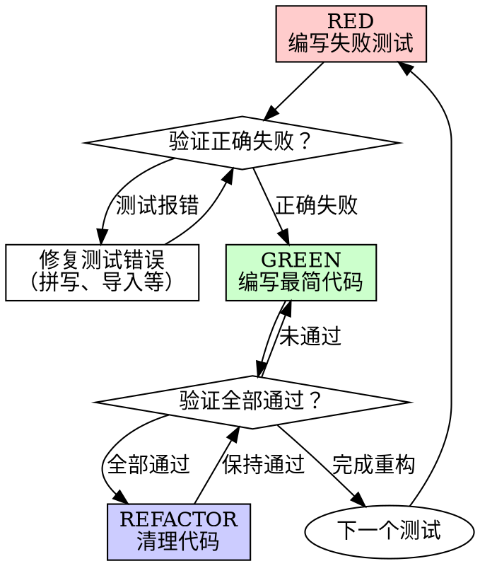

# Test-Driven Development - 测试驱动开发

## 铁律

```
NO PRODUCTION CODE WITHOUT A FAILING TEST FIRST
```

先写测试再写代码？**删除它。重新开始。**

**没有例外：**
- 不要保留作为"参考"
- 不要"适配"它到测试中
- 不要看它
- 删除就是删除

> **违反规则的字面意思就是违反规则的精神。**

## 何时使用

**总是使用：**
- 新功能开发
- Bug 修复
- 代码重构
- 行为变更

**例外（需询问用户）：**
- 一次性原型
- 生成的代码
- 配置文件

**如果你在想"这次跳过 TDD"——停止。这是合理化。**

## RED-GREEN-REFACTOR 循环



## 详细流程

### RED - 编写失败测试

编写一个最小测试，展示应该发生什么。

**好测试示例：**
```python
def test_retries_failed_operations_3_times():
    """失败操作应重试 3 次"""
    attempts = 0
    def operation():
        nonlocal attempts
        attempts += 1
        if attempts < 3:
            raise Error('fail')
        return 'success'
    
    result = retry_operation(operation)
    
    assert result == 'success'
    assert attempts == 3
```
✅ 清晰名称、测试真实行为、一件事

**坏测试示例：**
```python
def test_retry_works():
    mock = Mock()
    mock.side_effect = [Error(), Error(), 'success']
    retry_operation(mock)
    assert mock.call_count == 3
```
❌ 模糊名称、测试 mock 而非代码

**要求：**
- 一个行为
- 清晰名称（描述行为）
- 真实代码（除非不可避免，否则避免 mock）

### 验证 RED - 观看它失败

**强制。严禁跳过。**

```bash
# Python
python -m pytest path/to/test.py -v

# JavaScript
npm test path/to/test.test.js
```

确认：
- 测试失败（不是报错）
- 失败消息符合预期
- 失败原因是功能缺失（不是拼写错误）

**测试通过了？** 你在测试已有行为。修复测试。

**测试报错？** 修复错误，重新运行直到正确失败。

### GREEN - 最简代码

编写最简单的代码让测试通过。

**好的最简代码：**
```python
def retry_operation(fn):
    for i in range(3):
        try:
            return fn()
        except Exception as e:
            if i == 2:
                raise e
    raise Error('unreachable')
```
刚好足够通过

**过度设计：**
```python
def retry_operation(
    fn,
    max_retries=3,
    backoff='linear',
    on_retry=None
):
    # YAGNI - 你不需要这些
    pass
```
不要添加功能、重构其他代码，或"改进"到超出测试范围。

### 验证 GREEN - 观看它通过

**强制。**

```bash
python -m pytest path/to/test.py -v
```

确认：
- 测试通过
- 其他测试仍通过
- 输出干净（无错误、警告）

**测试失败？** 修复代码，不是测试。

**其他测试失败？** 立即修复。

### REFACTOR - 清理

仅在变绿之后：
- 消除重复
- 改进名称
- 提取辅助函数

保持测试通过。不要添加行为。

### 重复

下一个功能的下一个失败测试。

## 好测试的特征

| 特征 | 好的 | 坏的 |
|------|------|------|
| **最小化** | 一件事。名称中有"和"？拆分。 | `test_validates_email_and_domain_and_whitespace()` |
| **清晰** | 名称描述行为 | `test1()` |
| **展示意图** | 展示期望的 API | 隐藏代码应该做什么 |

## 为什么顺序重要

### "我会在之后写测试来验证它工作"

之后写的测试立即通过。立即通过证明不了什么：
- 可能测试了错误的东西
- 可能测试了实现而非行为
- 可能错过了你忘记的边界情况
- 你从没看到它捕获 bug

先测试迫使你看到测试失败，证明它实际测试了某些东西。

### "我已经手动测试了所有边界情况"

手动测试是临时的。你以为你测试了所有，但：
- 没有测试记录
- 代码变更时不能重新运行
- 压力下容易忘记情况
- "我试的时候工作" ≠ 全面

自动化测试是系统性的。每次都同样运行。

### "删除 X 小时的工作是浪费"

沉没成本谬误。时间已经没了。现在的选择：
- 删除并用 TDD 重写（X 更多小时，高信心）
- 保留并之后加测试（30 分钟，低信心，可能有 bug）

"浪费"是你不能信任的代码。没有真实测试的工作代码是技术债务。

### "TDD 是教条主义，实用主义意味着适应"

TDD **就是**实用的：
- 在提交前发现 bug（比之后调试更快）
- 防止回归（测试立即捕获破坏）
- 文档化行为（测试展示如何使用代码）
- 启用重构（自由变更，测试捕获破坏）

"实用"的捷径 = 生产环境调试 = 更慢。

## 常见合理化借口

| 借口 | 现实 |
|------|------|
| "太简单了，不需要测试" | 简单代码也会坏。测试只需 30 秒。 |
| "我会之后测试" | 之后立即通过的测试证明不了什么。 |
| "之后的测试达到同样目标" | 之后 = "这做什么？" 先 = "这应该做什么？" |
| "已经手动测试过了" | 临时 ≠ 系统性。无记录，不能重新运行。 |
| "删除 X 小时是浪费" | 沉没成本谬误。保留未验证代码是技术债务。 |
| "保留作为参考，先写测试" | 你会适配它。这就是之后测试。删除意味着删除。 |
| "需要先探索" | 可以。丢弃探索，用 TDD 开始。 |
| "测试难 = 设计不清" | 听测试的。难测试 = 难使用。 |
| "TDD 会拖慢我" | TDD 比调试快。实用 = 先测试。 |
| "手动测试更快" | 手动证明不了边界情况。每次变更都要重新测试。 |
| "现有代码没有测试" | 你在改进它。为现有代码加测试。 |

## 红旗 - 停止并重新开始

| 想法 | 现实 |
|------|------|
| "测试前写代码" | 立即停止，删除代码，用 TDD 重新开始 |
| "实现后加测试" | 之后立即通过的测试证明不了什么 |
| "测试立即通过" | 你在测试已有行为，不是新行为 |
| "不能解释为什么测试失败" | 测试必须有意图。不能解释 = 测试有问题 |
| "稍后加测试" | 稍后 = 永远不会。先测试 |
| "就这一次跳过" | 合理化"就这一次" = 每次都会跳过 |
| "已经手动测试过了" | 临时 ≠ 系统性。无记录，不能重新运行 |
| "之后的测试达到同样目的" | 之后 = "这做什么？" 先 = "这应该做什么？" |
| "这是精神不是仪式" | 违反规则的字面意思就是违反规则的精神 |
| "保留作为参考"或"适配现有代码" | 你会适配它。删除意味着删除 |
| "已经花了 X 小时，删除是浪费" | 沉没成本谬误。保留未验证代码是技术债务 |
| "TDD 是教条主义，我是实用主义" | TDD 比调试快。实用 = 先测试 |
| "这是不同的因为..." | 没有例外。删除代码。用 TDD 重新开始 |

**所有这些意味着：删除代码。用 TDD 重新开始。**

## 示例：Bug 修复

**Bug**: 空邮箱被接受

### RED
```python
def test_rejects_empty_email():
    result = submit_form({'email': ''})
    assert result.error == '邮箱不能为空'
```

### 验证 RED
```bash
$ python -m pytest
FAIL: expected '邮箱不能为空', got undefined
```

### GREEN
```python
def submit_form(data):
    if not data.get('email', '').strip():
        return {'error': '邮箱不能为空'}
    # ...
```

### 验证 GREEN
```bash
$ python -m pytest
PASS
```

### REFACTOR
为多字段提取验证（如需要）。

## 验证清单

### 单个测试循环验证（每个测试）

标记工作完成前：

- [ ] 每个新函数/方法都有测试
- [ ] 实现前 watched 每个测试失败
- [ ] 每个测试因预期原因失败（功能缺失，不是拼写错误）
- [ ] 编写了最简代码让每个测试通过
- [ ] 所有测试通过
- [ ] 输出干净（无错误、警告）
- [ ] 测试使用真实代码（除非不可避免，否则避免 mock）
- [ ] 覆盖边界情况和错误

不能勾选所有？你跳过了 TDD。重新开始。

### 功能完成验证（整个功能）

**什么时候停止写新测试？** 确认以下所有项：

**测试覆盖：**
- [ ] 所有计划中的行为都有对应的测试（对照 Spec）
- [ ] 每个新函数/方法都有测试
- [ ] 边界情况被覆盖（空值、极限值、异常输入）
- [ ] 错误路径被覆盖（失败场景、异常处理）
- [ ] 无遗漏的隐性需求（对照 Spec 逐条核对）

**代码质量：**
- [ ] 无重复代码（DRY）
- [ ] 命名清晰（函数/变量名称描述意图，不依赖注释解释）
- [ ] 无过度设计（没有超出当前测试范围的功能）

**验证状态：**
- [ ] 所有测试通过
- [ ] 测试输出干净（无错误、警告、跳过）

**判断：**
- ✅ 全部通过 → 功能完成，停止 TDD 循环
- ❌ 任一项未通过 → 继续循环（写新测试覆盖遗漏，或重构修复质量问题）

> **红旗**："我觉得差不多了" = 你没有对照 Spec 逐条核对。用检查清单，不要凭感觉。

## 卡住时

| 问题 | 解决方案 |
|------|---------|
| 不知道怎么测试 | 写期望的 API。先写断言。询问用户。 |
| 测试太复杂 | 设计太复杂。简化接口。 |
| 必须 mock 所有 | 代码太耦合。使用依赖注入。 |
| 测试设置巨大 | 提取辅助函数。还复杂？简化设计。 |

## 调试集成

发现 Bug？编写重现它的失败测试。遵循 TDD 循环。测试证明修复并防止回归。

**绝不修复没有测试的 bug。**

## 最终规则

```
生产代码 → 存在测试且先失败
否则 → 不是 TDD
```

没有用户明确许可的例外。

## 集成

**前置 Skill**: sw-writing-specs（提供实现计划）

**后续 Skill**: sw-subagent-development

**此 Skill 被调用时**: 
- 开始实现任何任务时
- 修复任何 bug 时
- 重构任何代码时

**子 Agent 必须遵循**: 
- 实现子 Agent 在执行每个任务时必须遵循此 Skill
- 代码审查子 Agent 必须验证 TDD 是否被遵循
