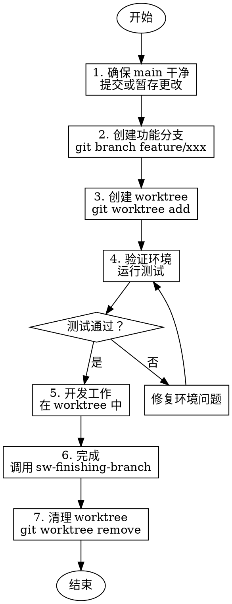

# Using Git Worktrees - Git 工作区管理

使用 Git worktree 创建隔离的工作空间，支持并行开发。

## 核心原则

**隔离 = 清晰**

- 每个功能在独立 worktree 中开发
- 保持 main 工作区干净
- 并行开发多个功能

## 何时使用


## Worktree 流程



## 详细步骤

### 1. 确保 main 干净

**检查状态**：
```bash
git status
```

**如有未提交更改**：
```bash
# 提交更改
git add .
git commit -m "wip: save current work"

# 或暂存
git stash push -m "work before starting feature/xxx"
```

### 2. 创建功能分支

**基于 main 创建分支**：
```bash
git checkout main
git pull origin main  # 确保最新
git branch feature/user-auth
```

### 3. 创建 Worktree

**创建 worktree 目录**：
```bash
# 创建 worktree 基础目录（如不存在）
mkdir -p ~/worktrees

# 创建 worktree
git worktree add ~/worktrees/feature-user-auth feature/user-auth
```

**验证创建**：
```bash
git worktree list
# 应显示：
# /path/to/main        abc1234 [main]
# /path/to/worktrees/feature-user-auth  def5678 [feature/user-auth]
```

### 4. 验证环境

**切换到 worktree**：
```bash
cd ~/worktrees/feature-user-auth
```

**安装依赖**：
```bash
# Python
pip install -r requirements.txt

# Node.js
npm install

# 通用
make setup  # 如果有
```

**运行测试**：
```bash
# Python
python -m pytest -v

# Node.js
npm test
```

**要求**：
- [ ] 依赖安装成功
- [ ] 测试基线通过
- [ ] 无环境错误

**如果失败**：
- 修复环境问题
- 重新运行测试
- 记录解决方案

### 5. 开发工作

**在 worktree 中进行**：
```bash
cd ~/worktrees/feature-user-auth

# 正常开发流程
# ...

# 提交更改
git add .
git commit -m "feat: implement user authentication"
```

**注意事项**：
- 在 worktree 中像在普通分支一样工作
- 可以同时在多个 worktree 工作
- main 工作区保持干净

### 6. 完成开发

**调用 finishing-branch Skill**：
```
调用 sw-finishing-branch Skill 完成这个分支
```

### 7. 清理 Worktree

**合并或丢弃后清理**：
```bash
# 切换到 main worktree
cd /path/to/main

# 移除 worktree
git worktree remove ~/worktrees/feature-user-auth

# 清理记录
git worktree prune

# 删除分支（如已合并）
git branch -d feature/user-auth
```

## Worktree 管理

### 列出所有 Worktree

```bash
git worktree list
```

输出示例：
```
/path/to/project          abc1234 [main]
/path/to/worktrees/feature-auth      def5678 [feature/user-auth]
/path/to/worktrees/feature-api       ghi9012 [feature/api-v2]
```

### 在 Worktree 间切换

```bash
# 使用 cd 切换
cd ~/worktrees/feature-user-auth

# 或从 main 工作区
cd /path/to/main
cd ~/worktrees/feature-user-auth
```

### 同步 main 更新

当 main 有更新时，同步到 feature 分支：

```bash
cd ~/worktrees/feature-user-auth

# 获取 main 更新
git fetch origin main

# 合并到 feature 分支
git merge origin/main

# 或使用 rebase
git rebase origin/main
```

### 查看 Worktree 状态

```bash
# 所有 worktree 状态
git worktree list --porcelain

# 详细状态
for wt in $(git worktree list --porcelain | grep worktree | cut -d' ' -f2); do
  echo "=== $wt ==="
  cd "$wt" && git status --short
done
```

## 并行开发示例

**场景**：同时开发两个功能

```bash
# 创建两个 worktrees
git worktree add ~/worktrees/feature-auth feature/user-auth
git worktree add ~/worktrees/feature-api feature/api-v2

# 终端 1 - 认证功能
cd ~/worktrees/feature-auth
# ... 开发 ...

# 终端 2 - API 功能
cd ~/worktrees/feature-api
# ... 开发 ...

# 两个功能独立进行，互不干扰
```

## 输出示例

### Worktree 创建成功

```markdown
## Git Worktree 创建成功

**分支**: `feature/user-auth`
**Worktree**: `~/worktrees/feature-user-auth`
**基于**: `main (abc1234)`

### 环境验证
- [x] 依赖安装成功
- [x] 测试基线通过 (42/42)
- [x] 无环境错误

### 下一步
1. 切换到 worktree: `cd ~/worktrees/feature-user-auth`
2. 执行 sw-brainstorming 开始设计
3. 或执行 sw-subagent-development 执行现有计划

### 提示
- 在此 worktree 中开发，保持 main 干净
- 可以同时创建多个 worktree 进行并行开发
- 完成后调用 sw-finishing-branch 清理
```

### Worktree 清理完成

```markdown
## Git Worktree 清理完成

**Worktree**: `~/worktrees/feature-user-auth`
**状态**: 已移除
**分支**: `feature/user-auth` (已合并到 main)

### 执行操作
- [x] 提交所有更改
- [x] 合并到 main
- [x] 移除 worktree
- [x] 删除分支
- [x] 清理 worktree 记录

### 当前状态
```bash
$ git worktree list
/path/to/project  abc1234 [main]
```

### 磁盘空间
- 已释放: ~150MB
```

## 红旗 - 停止并使用 Worktree

| 想法 | 现实 |
|------|------|
| "直接在现有目录开发，不用 worktree" | 隔离防止污染 main。worktree 提供真正的文件系统隔离 |
| "worktree 设置太麻烦" | 几分钟设置节省数小时冲突解决 |
| "测试在 main 通过就行，worktree 不用测" | worktree 环境可能不同，必须验证 |
| "这个功能很小，不用隔离" | 小功能也会破坏 main。隔离是纪律 |
| "分支就够了，不需要 worktree" | worktree 提供真正的隔离，不只是版本控制 |

## 常见借口表

| 借口 | 现实 |
|------|------|
| "这个功能很小，不用隔离" | 小功能也会破坏 main |
| "分支就够了，不需要 worktree" | worktree 提供真正的文件系统隔离 |
| "设置 worktree 太花时间" | 设置只需 2 分钟，冲突解决可能数小时 |
| "我可以在 main 暂存更改" | 暂存容易丢失或混淆 |
| "并行开发用分支切换就行" | 频繁切换分支容易出错，worktree 同时存在 |

## 最佳实践

1. **命名规范** - 分支名和 worktree 目录名一致
2. **定期同步** - 经常从 main 合并更新
3. **及时清理** - 合并后立即清理 worktree
4. **保持干净** - 每个 worktree 只做一个功能
5. **备份重要** - 推送分支到远程再删除本地

## 故障排除

### Worktree 创建失败

**问题**: `git worktree add` 失败
**解决**: 
- 确保分支不存在
- 确保目录为空或不存在
- 确保有权限创建目录

### 测试在 worktree 中失败

**问题**: 测试在 main 通过但在 worktree 失败
**解决**:
- 检查依赖版本
- 检查环境变量
- 检查路径相关代码

### 无法删除 worktree

**问题**: `git worktree remove` 失败
**解决**:
```bash
# 强制移除
git worktree remove --force ~/worktrees/feature-xxx

# 或手动删除后清理
git worktree prune
```

## 集成

**前置 Skill**: 无（这是工作流起点之一）

**后续 Skill**: 
- sw-brainstorming - 在 worktree 中开始设计
- sw-subagent-development - 在 worktree 中执行计划

**相关 Skill**:
- sw-finishing-branch - 完成后清理 worktree

## 项目集成示例

推荐使用 worktree 管理功能分支：

```bash
# 标准流程
git checkout main
git pull
git branch feature/xxx
git worktree add ~/worktrees/feature-xxx feature/xxx
cd ~/worktrees/feature-xxx

# 然后调用 Skill
# "使用 sw-brainstorming Skill 设计这个功能"
```
