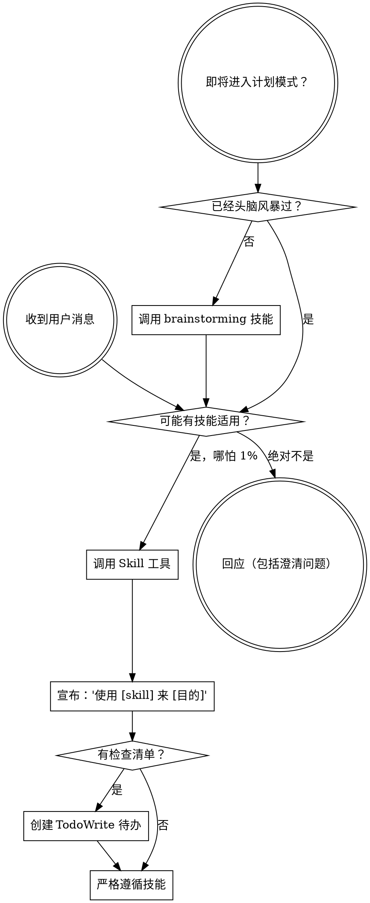

<SUBAGENT-STOP>
如果你作为子 Agent 被分派执行特定任务，跳过此技能。
</SUBAGENT-STOP>

<EXTREMELY-IMPORTANT>
如果你认为有哪怕 1% 的概率某个技能可能适用于你正在做的事，你**绝对必须**调用该技能。

如果某个技能适用于你的任务，你别无选择。**你必须使用它。**

这不是可协商的。这不是可选的。你无法合理化地逃避它。
</EXTREMELY-IMPORTANT>

## 指令优先级

Superpowers 技能覆盖默认系统提示行为，但**用户指令始终优先**：

1. **用户的明确指令**（CLAUDE.md、GEMINI.md、AGENTS.md、直接请求）—— 最高优先级
2. **Superpowers 技能** —— 在与默认系统行为冲突时覆盖
3. **默认系统提示** —— 最低优先级

如果 AGENTS.md 说"不要用 TDD"而某个技能说"始终用 TDD"，遵循用户的指令。用户拥有控制权。

## 如何访问技能

**在 Claude Code 中：** 使用 `Skill` 工具。调用技能时，其内容会被加载并直接呈现给你——直接遵循它。绝不要用 Read 工具读取技能文件。

**在 Copilot CLI 中：** 使用 `skill` 工具。技能从安装的插件中自动发现。`skill` 工具与 Claude Code 的 `Skill` 工具工作方式相同。

**在 Gemini CLI 中：** 技能通过 `activate_skill` 工具激活。Gemini 在会话开始时加载技能元数据，并在需要时激活完整内容。

**在其他环境中：** 查看你平台的文档以了解如何加载技能。

## 平台适配

技能使用 Claude Code 工具名称。非 CC 平台：参见 `references/copilot-tools.md`（Copilot CLI）、`references/codex-tools.md`（Codex）以了解工具等效项。Gemini CLI 用户通过 GEMINI.md 自动获得工具映射。

**OpenCode 用户：** 当技能引用你没有的工具时，替换为 OpenCode 等效项：

| Claude Code 工具 | OpenCode 等效项 |
|-----------------|----------------|
| `TodoWrite` | `todowrite` |
| `Task` 工具配子 Agent | 使用 OpenCode 的子 Agent 系统 |
| `Skill` 工具 | OpenCode 原生 `skill` 工具 |
| `Read` | `read` |
| `Write` | `write` |
| `Edit` | `edit` |
| `Bash` | `bash` |
| `Grep` | `grep` |
| `Glob` | `glob` |
| `WebFetch` | `webfetch` |
| `WebSearch` | （如需要，使用 `webfetch` 访问搜索引擎） |

# 使用技能

## 规则

**在做出任何回应或行动之前调用相关或被请求的技能。** 即使只有 1% 的概率某个技能可能适用，你也应该调用该技能来检查。如果被调用的技能结果不适用于当前情况，你不需要使用它。

## 红旗

这些想法意味着停止——你在合理化：

| 想法 | 现实 |
|------|------|
| "这只是个简单问题" | 问题是任务。检查技能。 |
| "我需要更多上下文先" | 技能检查先于澄清问题。 |
| "让我先探索代码库" | 技能告诉你 HOW 探索。先检查。 |
| "我可以快速检查 git/文件" | 文件缺乏会话上下文。检查技能。 |
| "让我先收集信息" | 技能告诉你 HOW 收集信息。 |
| "这不需要正式技能" | 如果技能存在，使用它。 |
| "我记得这个技能" | 技能会演进。读取当前版本。 |
| "这不算是任务" | 行动 = 任务。检查技能。 |
| "这技能大材小用" | 简单的东西会变复杂。使用它。 |
| "我先做这一件事" | 在做任何事之前先检查。 |
| "这感觉很 productive" | 无纪律的行动浪费时间。技能防止这个。 |
| "我知道那是什么意思" | 知道概念 ≠ 使用技能。调用它。 |

## 常见借口表

| 借口 | 现实 |
|------|------|
| "这个任务太简单，不需要技能" | 简单任务也会变复杂。技能防止已知错误 |
| "我已经知道怎么处理" | 技能会演进。读取当前版本，不凭记忆 |
| "先做完这一件事再检查技能" | 在做任何事之前先检查。事后检查 = 已犯错 |
| "技能检查浪费时间" | 10 秒检查可能节省数小时返工 |
| "这个场景太特殊，没有对应技能" | 即使 1% 概率适用也要检查。你可能错了 |

## 技能优先级

当多个技能可能适用时，使用此顺序：

1. **流程技能优先**（brainstorming、debugging）—— 这些决定 HOW 接近任务
2. **实现技能其次**（frontend-design、mcp-builder）—— 这些指导执行

"让我们构建 X" → brainstorming 优先，然后实现技能。
"修复这个 Bug" → debugging 优先，然后领域特定技能。

## 技能类型

**刚性**（TDD、debugging）：精确遵循。不要淡化纪律。

**灵活**（patterns）：根据上下文调整原则。

技能本身会告诉你属于哪种。

## 用户指令

指令说的是 WHAT，不是 HOW。"添加 X" 或 "修复 Y" 并不意味着跳过工作流。
