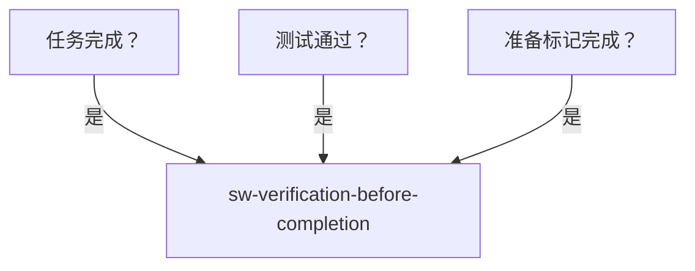
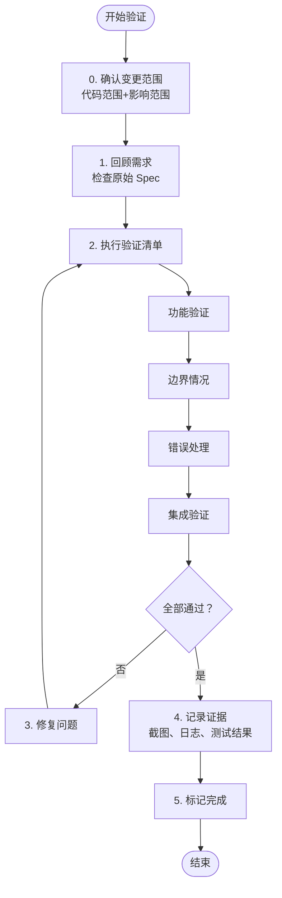

# Verification Before Completion - 完成前验证

在标记任何任务或项目为完成之前，验证它实际工作并符合需求。

## 核心原则

**证据 > 声称**

- 不要假设它工作——证明它工作
- 验证所有需求
- 检查边界情况
- 测试失败场景
- **子 Agent 说完成了 ≠ 验证完成** — 亲自运行验证，不要采信未经验证的完成报告

## 铁律

```
NO COMPLETION WITHOUT VERIFICATION
```

没有经过验证的工作不算完成。

**没有例外：**
- "它应该工作" ≠ 它工作
- "我检查过了" ≠ 验证
- "测试通过了" ≠ 功能正确

## 何时使用



## 验证流程



## 验证未通过时的处理

- **简单问题**（如参数校验遗漏、错误消息不清、边界值处理不当）→ 直接修复，回到步骤 2 **重新运行全部验证**
- **系统性 / 难以定位的问题**（如逻辑错误导致多测试失败、性能退化、并发异常）→ 调用 **`sw-systematic-debugging`** 排查根因，修复后回到本 skill **重新运行全部验证**

> **铁律：修复后只重测修复项 = 给回归留门。** 任何代码更改都可能影响不相关的功能。修复后必须重新执行完整的验证清单。

## 变更范围确认（验证前必须执行）

盲目执行检查清单 = 低效或遗漏。先确认变更边界：

- [ ] **代码范围** — 本次变更涉及哪些文件/模块
- [ ] **影响范围** — 哪些模块可能间接受影响（依赖关系、共享代码）
- [ ] **验证策略** — 优先验证变更区域 → 验证影响区域 → 回归验证

### 无 Spec 时的需求确认

并非所有任务都有 Spec。无 Spec 时按以下步骤推断需求：

1. **查看代码变更本身** — `git diff` 推断变更意图
2. **检查相关 issue/PR** — 查找原始需求描述
3. **询问用户确认** — 如有疑问，不猜测，直接问
4. **记录推断的假设** — 将需求假设写入验证报告，作为验证依据

> 无 Spec ≠ 无需求。你的验证依据可以是 issue 描述、代码变更意图、或用户确认。

## 验证检查清单

完整验证检查清单（含按任务类型的专项验证）参见 [verification-checklists.md](verification-checklists.md)。

**验证优先级摘要**：

| 优先级 | 检查项 | 说明 |
|--------|--------|------|
| **不可跳过** | 功能验证、回归验证 | 核心功能不可用 = 不能标记完成 |
| **强烈建议** | 边界情况、错误处理 | 生产环境故障的主要来源 |
| **条件允许** | 性能、安全、兼容性 | 如项目有明确要求则必须验证 |

## 验证方法

| 场景 | 推荐方法 | 示例 |
|------|---------|------|
| 快速验证单个函数 | 手动测试 | `python -c "from mymodule import func; print(func('test'))"` |
| 验证代码行为正确性 | 自动化测试 | 运行测试套件，检查覆盖率符合项目要求 |
| 验证模块间交互 | 集成测试 | `./scripts/integration-test.sh` 或 `npm run e2e` |
| 验证需求满足度 | 验收测试 | 对照 Spec 验收标准逐项确认 |

### 验收测试示例

```markdown
## 原始验收标准
- [x] 用户可以注册账号
- [x] 用户可以登录
- [ ] 用户可以修改个人信息 ← 未完成
```

验证设计方法论与常见陷阱参见 [verification-methodology.md](verification-methodology.md)。

验证文档模板与报告示例参见 [verification-reporting.md](verification-reporting.md)。

## 红旗 - 停止标记完成

| 想法 | 现实 |
|------|------|
| "没有经过任何验证，但应该工作" | "应该工作" ≠ 它工作。没有经过验证的工作不算完成 |
| "只在开发环境测试就够了" | 开发和生产环境可能不同。在目标环境验证 |
| "边界情况不太会发生" | 边界情况总是会发生。不测试 = 生产环境 surprise |
| "错误处理不需要测试" | 错误处理是可靠性关键。不测试 = 未知故障模式 |
| "验证后改了一点点" | 验证后修改了代码 = 需要重新验证。任何更改都可能引入 bug |
| "测试通过了，所以功能正确" | "测试通过了" ≠ 功能正确。测试可能遗漏场景 |
| "用户说先标记完成，以后再验证" | 用户的紧急 ≠ 你的跳过纪律。验证完成后再标记 |
| "就剩这一点了，先完成再验证" | 疲劳和沉没成本是理性化的温床。最后一步最容易出错 |
| "这个任务不需要验证" | 除非用户明确豁免，否则所有交付物都需要验证 |
| "部分验证就够了，不用全部清单" | 检查清单是系统性的。跳过任何一项 = 给 bug 留门 |
| "CI 通过了所以不需要额外验证" | CI 是通用检查，不覆盖你的特定变更场景。任务级验证不可替代 |
| "Linter/Formatter 通过了所以代码没问题" | 代码风格正确 ≠ 功能正确。静态检查不验证行为 |
| "这个 bug 是已知的，不在本次范围" | 你的变更可能让已知 bug 变得更严重。验证时观察所有异常 |
| "子 Agent 报告任务已完成" | 子 Agent 的完成报告是输入，不是证据。你必须亲自运行验证 |

## 常见借口表

| 借口 | 现实 |
|------|------|
| "验证太费时间" | 未验证的代码可能引入隐藏 bug，后期修复更耗时 |
| "我已经手动检查过了" | 手动检查 ≠ 验证。验证需要系统性、可重复的证据 |
| "这些边界情况不太可能发生" | 边界情况在生产环境中总是发生 |
| "错误场景很难测试" | 难测试的错误场景正是最需要验证的 |
| "代码改了一点点，不用重测" | 任何代码更改都可能引入回归。重新验证是纪律 |
| "用户催着完成，先标记再说" | 未经验证的完成 = 把风险推给用户。时间压力不是跳过验证的理由 |
| "这个改动太简单了不需要验证" | 简单改动也会坏。30 秒验证 vs 数小时返工 |
| "其他 Agent/子流程已经验证过了" | 验证责任不可转移。谁标记完成，谁负责验证 |
| "我只是改了个文档/注释" | 文档错误同样会造成损失。格式、链接、准确性都需要验证 |
| "测试覆盖了所以不用手动验证" | 测试可能遗漏场景。自动化 + 手动验证互补 |
| "项目没有测试框架，没法验证" | 没有自动化测试 ≠ 不能验证。手动测试、代码审查、试运行都是验证 |
| "CI 已经通过了" | CI 是通用守门员，不保证你的特定变更在所有场景下正确。任务级验证不可替代 |
| "Linter/Formatter 全绿" | 静态分析检查的是格式和基本语法，不验证逻辑正确性 |
| "这个失败是已知的旧 bug" | 你的变更可能暴露或加剧旧 bug。已知 ≠ 可忽略 |
| "修复后只测了改动的地方" | 任何代码改动都有回归风险。修复后必须重测全部验证项 |

## 与 TDD 的关系

**TDD 验证代码行为** — 单元测试验证函数行为，确保写代码前有测试

**完成前验证验证功能完整** — 集成测试验证整体功能，验收测试验证需求满足，确保标记完成前有证据

**两者都需要**

### TDD 测试通过 ≠ 验证完成

| 场景 | TDD 状态 | 本 Skill 状态 | 原因 |
|------|---------|-------------|------|
| 测试覆盖了函数，但遗漏了用户流程 | 测试通过 | ❌ 未验证 | TDD 验证函数，不保证端到端 |
| 测试断言了实现细节，而非行为 | 测试通过 | ❌ 未验证 | 测试可能随实现变更而失效 |
| 测试通过了，但未对照 Spec 验收标准 | 测试通过 | ❌ 未验证 | 可能遗漏了隐性需求 |
| 新增功能测试通过，但破坏了原有功能 | 新测试通过 | ❌ 未验证 | 缺少回归验证 |

## 输出示例

输出示例参见 [verification-reporting.md](verification-reporting.md)。

## 集成

**前置 Skill**: 
- sw-subagent-development - 完成任务
- sw-test-driven-dev - 确保代码质量

**后续 Skill**: 
- 无（工作流终点）

**相关 Skill**:
- sw-systematic-debugging - 如果发现问题

### 与 sw-finishing-branch 的边界

两个 Skill 都涉及"验证"，但职责和时机不同：

| 维度 | sw-verification-before-completion（本 Skill） | sw-finishing-branch |
|------|-------------------------------------------|---------------------|
| **粒度** | 任务级别（单个任务/功能完成后） | 分支级别（所有任务完成后，合并前） |
| **触发时机** | 每次标记"任务完成"时 | 整个分支开发结束后 |
| **验证范围** | 当前任务的正确性和完整性 | 整个分支的测试套件 + 代码审查 + 合并准备 |
| **决策输出** | 通过 → 标记任务完成；不通过 → 修复 | 通过 → 合并/PR/保留/丢弃分支 |

**调用关系**：
```
sw-subagent-development 完成单个任务
        ↓
sw-verification-before-completion（任务级别验证）
        ↓
    所有任务完成？
        ↓
sw-finishing-branch（分支级别验证 + 合并决策）
```

**示例**：每完成一个子任务后调用 **本 Skill** 验证；所有子任务完成后调用 **sw-finishing-branch** 决定合并策略

## 最小可执行检查

检查清单中的"无安全漏洞"和"性能可接受"不能空口无凭。最小可执行动作：

### 安全最小检查

- [ ] **无硬编码密钥** — 搜索 `password`, `secret`, `token`, `api_key` 等关键词，确认未硬编码
- [ ] **输入已校验** — 所有外部输入（HTTP 参数、文件、环境变量）都有长度/类型/范围校验
- [ ] **依赖无已知漏洞** — 运行 `safety check` 或 `npm audit`，无高危漏洞（如工具不可用则跳过并记录）

### 性能最小检查

- [ ] **关键路径响应时间** — 核心 API/操作在可接受时间内完成（手动计时或对比基线）
- [ ] **无 N+1 查询** — 数据操作检查是否有循环查询（查看日志中的查询次数）
- [ ] **大数据量不溢出** — 处理大数据量时内存使用稳定（观察进程内存或测试 10k+ 条记录）

## 验证工具

```bash
# Python 测试
pytest -v --tb=short
pytest --cov=mymodule --cov-report=html

# API 测试
curl -X POST http://localhost/api/endpoint \
  -H "Content-Type: application/json" \
  -d '{"key": "value"}'

# 数据库快速验证
sqlite3 mydb.db "SELECT * FROM mytable LIMIT 5"

# 集成/端到端测试
./scripts/integration-test.sh
npm run e2e

# 性能测试
ab -n 1000 -c 10 http://localhost/api/endpoint

# 安全检查
bandit -r mymodule/
safety check
```

## 最佳实践

1. **自动化优先，记录证据** - 自动化验证，保留可复现的命令和输出
2. **在目标环境验证** - 开发和生产可能不同
3. **测试失败场景，验证后不改** - 覆盖错误路径，修改后重测全部
4. **独立验证** - 如果可能，由其他人验证
