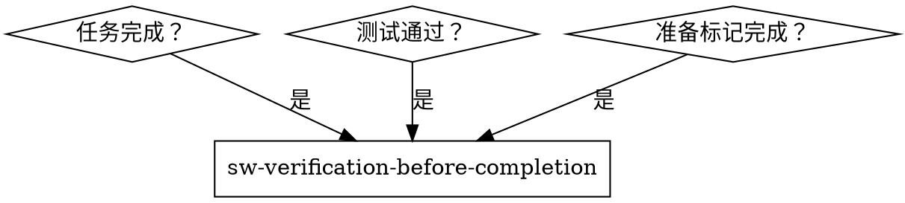
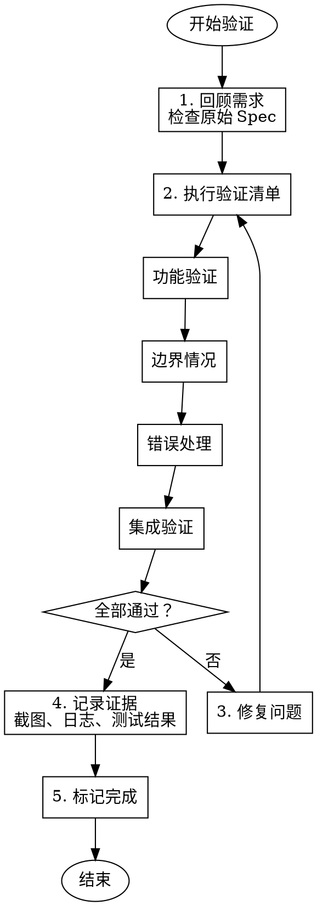

# Verification Before Completion - 完成前验证

在标记任何任务或项目为完成之前，验证它实际工作并符合需求。

## 核心原则

**证据 > 声称**

- 不要假设它工作——证明它工作
- 验证所有需求
- 检查边界情况
- 测试失败场景

## 铁律

```
NO COMPLETION WITHOUT VERIFICATION
```

没有经过验证的工作不算完成。

**没有例外：**
- "它应该工作" ≠ 它工作
- "我检查过了" ≠ 验证
- "测试通过了" ≠ 功能正确

## 何时使用



## 验证流程



## 验证检查清单

### 功能验证

- [ ] **主要功能** - 核心功能正常工作
- [ ] **次要功能** - 次要功能正常工作
- [ ] **用户流程** - 完整用户流程可执行
- [ ] **数据流** - 数据正确流动

### 边界情况

- [ ] **空输入** - 处理空值/空字符串
- [ ] **最大/最小值** - 处理极限值
- [ ] **特殊字符** - 处理特殊字符
- [ ] **大数据量** - 处理大量数据
- [ ] **并发** - 处理并发情况（如适用）

### 错误处理

- [ ] **无效输入** - 拒绝无效输入
- [ ] **异常情况** - 优雅处理异常
- [ ] **错误消息** - 错误消息清晰有用
- [ ] **恢复** - 能从错误中恢复

### 集成验证

- [ ] **依赖服务** - 依赖服务正常交互
- [ ] **数据库** - 数据库操作正确
- [ ] **API** - API 调用正确
- [ ] **文件系统** - 文件操作正确

### 非功能验证

- [ ] **性能** - 响应时间可接受
- [ ] **安全性** - 无安全漏洞
- [ ] **兼容性** - 目标环境兼容
- [ ] **资源使用** - 资源使用合理

## 验证方法

### 1. 手动测试

```bash
# 执行功能
python -c "from mymodule import myfunction; print(myfunction('test'))"

# 检查输出
curl http://localhost:8080/api/endpoint

# 查看数据
sqlite3 mydb.db "SELECT * FROM mytable LIMIT 5"
```

### 2. 自动化测试

```bash
# 运行测试套件
python -m pytest -v

# 检查覆盖率
pytest --cov=mymodule --cov-report=term-missing

# 检查覆盖率 >= 80%
```

### 3. 集成测试

```bash
# 测试完整流程
./scripts/integration-test.sh

# 测试 API
./scripts/api-test.sh

# 端到端测试
npm run e2e
```

### 4. 验收测试

对照原始 Spec 的验收标准：

```markdown
## 原始验收标准
- [x] 用户可以注册账号
- [x] 用户可以登录
- [x] 用户可以重置密码
- [ ] 用户可以修改个人信息 ← 未完成
```

## 验证文档

### 记录什么

```markdown
## 验证报告

**项目/任务**: [名称]
**验证时间**: YYYY-MM-DD HH:MM
**验证者**: [Agent/用户]

### 测试环境
- OS: [操作系统]
- Python: [版本]
- 依赖: [关键依赖版本]

### 功能验证
| 功能 | 状态 | 证据 |
|------|------|------|
| 功能 1 | ✅ | 测试通过: test_feature1.py |
| 功能 2 | ✅ | 手动测试: [截图/日志] |
| 功能 3 | ❌ | 问题: [描述] |

### 边界情况
| 场景 | 状态 | 证据 |
|------|------|------|
| 空输入 | ✅ | 返回错误: "输入不能为空" |
| 大数据量 | ✅ | 处理 10k 条记录耗时 2s |

### 错误处理
| 错误类型 | 状态 | 证据 |
|----------|------|------|
| 无效参数 | ✅ | HTTP 400, 错误消息清晰 |
| 数据库错误 | ✅ | 优雅降级，记录日志 |

### 未通过项目
1. [ ] [问题描述] - [修复计划]

### 结论
- [ ] 全部通过，可以标记完成
- [ ] 有需要修复的问题
```

## 常见验证陷阱

| 陷阱 | 问题 | 正确做法 |
|------|------|---------|
| **只测成功路径** | 遗漏错误处理 | 测试失败场景 |
| **用生产数据测试** | 风险高 | 使用测试数据 |
| **只在开发环境测试** | 环境问题 | 在目标环境测试 |
| **依赖手动验证** | 不可重复 | 自动化验证 |
| **验证后修改代码** | 引入新 bug | 修改后重新验证 |

## 红旗 - 停止标记完成

| 想法 | 现实 |
|------|------|
| "没有经过任何验证，但应该工作" | "应该工作" ≠ 它工作。没有经过验证的工作不算完成 |
| "只在开发环境测试就够了" | 开发和生产环境可能不同。在目标环境验证 |
| "边界情况不太会发生" | 边界情况总是会发生。不测试 = 生产环境 surprise |
| "错误处理不需要测试" | 错误处理是可靠性关键。不测试 = 未知故障模式 |
| "验证后改了一点点" | 验证后修改了代码 = 需要重新验证。任何更改都可能引入 bug |
| "测试通过了，所以功能正确" | "测试通过了" ≠ 功能正确。测试可能遗漏场景 |

## 常见借口表

| 借口 | 现实 |
|------|------|
| "验证太费时间" | 未验证的代码可能引入隐藏 bug，后期修复更耗时 |
| "我已经手动检查过了" | 手动检查 ≠ 验证。验证需要系统性、可重复的证据 |
| "这些边界情况不太可能发生" | 边界情况在生产环境中总是发生 |
| "错误场景很难测试" | 难测试的错误场景正是最需要验证的 |
| "代码改了一点点，不用重测" | 任何代码更改都可能引入回归。重新验证是纪律 |

## 与 TDD 的关系

**TDD 验证代码行为**
- 单元测试验证函数行为

**完成前验证验证功能完整**
- 集成测试验证整体功能
- 验收测试验证需求满足

**两者都需要**

## 输出示例

### 验证通过

```markdown
## 完成前验证报告

**任务**: 用户认证功能
**状态**: ✅ 全部通过

### 验证结果
| 类别 | 通过 | 总计 |
|------|------|------|
| 功能验证 | 5 | 5 |
| 边界情况 | 8 | 8 |
| 错误处理 | 4 | 4 |
| 集成测试 | 3 | 3 |

### 证据
- 测试报告: [链接]
- 覆盖率: 87%
- 手动测试: [截图]

### 结论
✅ **可以标记完成**
所有验收标准已满足，功能完整。
```

### 验证未通过

```markdown
## 完成前验证报告

**任务**: 用户认证功能
**状态**: ❌ 需要修复

### 未通过项目
1. **边界情况 - 空密码**
   - 期望: 拒绝空密码
   - 实际: 接受空密码
   - 严重性: 严重

2. **错误处理 - 数据库错误**
   - 期望: 返回友好错误
   - 实际: 抛出异常，返回 500
   - 严重性: 中等

### 修复计划
1. 添加空密码验证
2. 添加数据库错误处理
3. 重新运行验证

### 结论
❌ **不能标记完成**
需要修复上述问题后重新验证。
```

## 集成

**前置 Skill**: 
- sw-subagent-development - 完成任务
- sw-test-driven-dev - 确保代码质量

**后续 Skill**: 
- sw-finishing-branch - 最终完成

**相关 Skill**:
- sw-systematic-debugging - 如果发现问题

## 验证工具

```bash
# Python 测试
pytest -v --tb=short
pytest --cov=mymodule --cov-report=html

# API 测试
curl -X POST http://localhost/api/endpoint \
  -H "Content-Type: application/json" \
  -d '{"key": "value"}'

# 性能测试
ab -n 1000 -c 10 http://localhost/api/endpoint

# 安全检查
bandit -r mymodule/
safety check
```

## 最佳实践

1. **自动化优先** - 自动化验证，不是手动
2. **在目标环境验证** - 开发和生产可能不同
3. **测试失败场景** - 不要只测成功路径
4. **记录证据** - 截图、日志、测试报告
5. **验证后不要改** - 修改后需要重新验证
6. **独立验证** - 如果可能，由其他人验证
