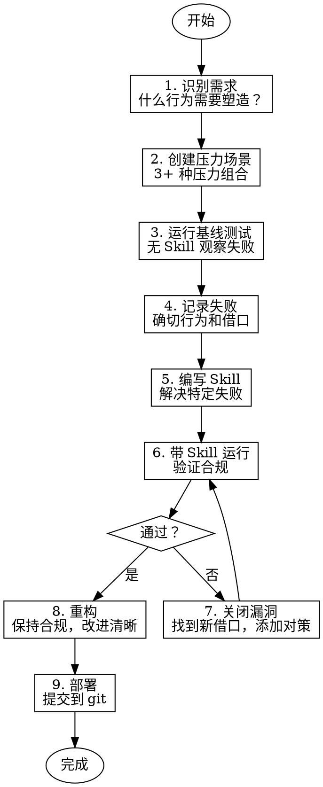

# Smart Router Writing Skills - 编写 Skill

为 Smart Router 项目创建、编辑和验证 Superpowers 风格的 Skill。

## 核心原则

**编写 Skill = 将 TDD 应用于流程文档**

- 先测试，后编写 Skill
- 观察失败，理解问题
- 编写 Skill 解决那些失败
- 验证，然后重构

## 铁律

```
NO SKILL WITHOUT A FAILING TEST FIRST
```

编写 Skill 前先测试？删除它。重新开始。

**没有例外：**
- 不要直接编写 Skill
- 不要"参考"现有 Skill
- 不要"先写一个草案"

## 什么是 Skill

**Skill 是：**
- 可复用的技术、模式、工具
- 参考指南
- 塑造 Agent 行为的代码

**Skill 不是：**
- 你如何解决问题的叙事
- 一次性解决方案
- 项目特定的约定

## TDD 应用于 Skill

| TDD 概念 | Skill 创建对应 |
|---------|---------------|
| **测试用例** | 压力场景 + 子 Agent |
| **生产代码** | Skill 文档 (SKILL.md) |
| **测试失败 (RED)** | Agent 违反规则（基线） |
| **测试通过 (GREEN)** | Agent 遵守 Skill |
| **重构** | 关闭漏洞，保持合规 |

## Skill 创建流程



## 详细步骤

### 1. 识别需求

**何时创建 Skill：**

- [ ] 技术不是直观明显的
- [ ] 你会在多个项目中参考
- [ ] 模式广泛适用（不是项目特定）
- [ ] 其他人会受益

**不要为以下创建 Skill：**
- 一次性解决方案
- 其他地方有良好文档的标准实践
- 项目特定约定（放入 CLAUDE.md）
- 可用正则/验证强制的内容（自动化，不写文档）

### 2. 创建压力场景

**什么是压力场景：**

模拟 Agent 在压力下的行为：
- 时间压力（"快速完成"）
- 沉没成本（"已经花了 X 小时"）
- 权威压力（"用户说..."）
- 疲劳（"最后一步了"）

**示例场景：**

```markdown
## TDD 压力场景

**场景**: 用户要求快速修复 bug

**压力**: 
- "这只是个小 bug"
- "快点，我们在赶时间"
- "我知道问题在哪"

**期望行为**:
- 编写失败测试
- 验证测试失败
- 然后实现修复

**预期失败（无 Skill）**:
- 直接修复 bug
- "测试会在之后补"
- "已经手动测试过了"
```

### 3. 运行基线测试

**方法：**

1. 创建子 Agent
2. 给它压力场景
3. **不提供 Skill 文档**
4. 观察它做什么
5. 记录确切行为

**记录内容：**
- 它做了什么选择？
- 用了什么借口？（原话）
- 哪些压力触发了违规？

### 4. 记录失败

**基线测试报告：**

```markdown
## 基线测试结果

**场景**: TDD 压力测试
**Agent**: 无 Skill

### 观察到的行为
1. 用户要求快速修复 bug
2. Agent 立即开始编写修复代码
3. 没有编写测试

### 使用的借口
- "这是个小修复，不需要测试"
- "我会在之后补测试"
- "我已经手动验证过了"

### 触发违规的压力
- 时间压力（"快速"）
- 问题看起来简单
```

### 5. 编写 Skill

**Skill 结构：**

```markdown
---
name: skill-name
description: "Use when [具体触发条件和症状]"
---

# Skill 名称

## 铁律
```
关键规则
```

## 流程
[流程图和说明]

## 红旗 - 立即停止
- [违规迹象列表]

## 合理化借口表
| 借口 | 现实 |
|------|------|
| [观察到的借口] | [反驳] |
```

**编写原则：**
- 解决基线测试中观察到的确切失败
- 不要为假设情况添加内容
- 明确、具体、可执行

### 6. 验证合规

**方法：**

1. 创建子 Agent
2. 给它相同的压力场景
3. **提供 Skill 文档**
4. 观察它是否遵守

**如果失败：**
- 回到步骤 5，强化 Skill
- 关闭它找到的漏洞
- 重新测试

### 7. 关闭漏洞

**寻找新借口：**

Agent 会找到你没想到的借口：
- "我会保留作为参考"
- "适配现有代码是实用主义"
- "这是关于精神不是仪式"

**添加到 Skill：**

```markdown
## 红旗 - 立即停止
- 代码在测试前
- "我会之后测试"
- "已经手动测试过了"
- "保留作为参考"
- **所有这些都意味着：删除代码，用 TDD 重新开始**
```

### 8. 重构

**改进清晰性，不改变行为：**
- 更好的命名
- 更清晰的流程图
- 更好的示例
- 更多场景覆盖

**保持合规：** 重构后重新测试。

### 9. 部署

```bash
# 保存到 Skill 目录
cp skill.md ~/.kimi/skills/my-skill/SKILL.md

# 提交到 git
git add ~/.kimi/skills/my-skill/
git commit -m "feat: add my-skill for ..."
```

## Skill 文件结构

```
skills/skill-name/
├── SKILL.md                    # 主 Skill 文件（必需）
├── subagent-prompts/           # 子 Agent 提示词（可选）
│   └── subagent-prompt.md
└── templates/                  # 模板文件（可选）
    └── template.md
```

## SKILL.md 结构

```markdown
---
name: Skill-Name-With-Hyphens
description: "Use when [具体触发条件和症状]"
---

# Skill 名称

## 铁律
[关键规则，不可违反]

## 流程
[流程图和详细步骤]

## 详细说明
[每个步骤的详细解释]

## 红旗 - 立即停止
[违规迹象列表]

## 常见借口表
| 借口 | 现实 |
|------|------|
| [借口] | [反驳] |

## 示例
[具体示例]

## 集成
[前置和后续 Skill]

## 输出示例
[期望的输出格式]
```

## 描述字段（关键）

**Claude Search Optimization (CSO)**

```yaml
# ❌ 错误：描述中总结了工作流程
description: Use when executing plans - dispatches subagent per task with code review between tasks

# ✅ 正确：只描述触发条件
description: Use when executing implementation plans with independent tasks in the current session
```

**为什么重要：** 描述总结了工作流程时，Claude 可能只读描述而不读完整 Skill，导致行为错误。

**好的描述：**
- 以 "Use when..." 开头
- 描述触发条件和症状
- 不包含工作流程摘要
- 使用具体、技术中性的语言

## 理性化防护表

**阻止 Agent 找借口：**

```markdown
## 常见借口

| 借口 | 现实 |
|------|------|
| "太简单了，不需要测试" | 简单代码也会坏。测试只需 30 秒。 |
| "我会之后测试" | 之后立即通过的测试证明不了什么。 |
| "之后的测试达到同样目标" | 之后 = "这做什么？" 先 = "这应该做什么？" |
| "已经手动测试过了" | 临时 ≠ 系统性。无记录，不能重新运行。 |
| "删除 X 小时是浪费" | 沉没成本谬误。保留未验证代码是技术债务。 |
```

## 测试方法

### 子 Agent 测试

```markdown
**测试场景**: [描述]

**输入**: [给子 Agent 的指令]

**期望行为**: [期望它做什么]

**通过标准**: [如何验证通过]
```

### 压力类型

| 压力类型 | 描述 | 示例 |
|----------|------|------|
| **时间** | "快点完成" | "我们在赶时间" |
| **沉没成本** | "已经花了 X 小时" | "删除这么多工作是浪费" |
| **权威** | "用户说..." | "用户说直接修复" |
| **疲劳** | "最后一步了" | "就剩这一点了" |
| **简单** | "这很简单" | "只是个小修复" |

### 组合压力

最有效的测试组合多种压力：
- 时间 + 沉没成本
- 权威 + 简单
- 疲劳 + "这只是次要的"

## Skill 类型

| 类型 | 说明 | 示例 |
|------|------|------|
| **Technique** | 具体方法步骤 | condition-based-waiting |
| **Pattern** | 思维方式 | flatten-with-flags |
| **Reference** | API/工具文档 | office-docs |

## 反模式

### ❌ 叙事示例
```markdown
"In session 2025-10-03, we found empty projectDir caused..."
```
**为什么坏**: 太具体，不可复用

### ❌ 多语言稀释
```markdown
example-js.js, example-py.py, example-go.go
```
**为什么坏**: 质量平庸，维护负担

### ❌ 流程图中的代码
```dot
step1 [label="import fs"];
step2 [label="read file"];
```
**为什么坏**: 不能复制粘贴，难读

### ❌ 通用标签
```dot
helper1, helper2, step3, pattern4
```
**为什么坏**: 标签应该有语义意义

## 输出示例

### Skill 创建完成

```markdown
## Skill 创建完成

**名称**: sw-my-skill
**位置**: ./skills/sw-superpower/my-skill/SKILL.md

### 测试结果
- 基线测试: ✅ 观察到 5 种失败模式
- Skill 测试: ✅ 所有场景通过
- 漏洞关闭: ✅ 3 个新借口已添加对策

### Skill 信息
- 大小: 8.5KB
- Token: ~2000
- 描述: "Use when ..."

### 使用方式
```
参考 sw-my-skill Skill 处理这个场景
```
```

## 集成

**前置 Skill**: 无（这是元 Skill）

**后续 Skill**: 
- 创建好的 Skill 可用于后续工作流

**使用此 Skill 创建:**
- sw-brainstorming
- sw-test-driven-dev
- sw-subagent-development
- 其他所有 Skill

## 创建检查清单

- [ ] 识别真实需求
- [ ] 创建 3+ 压力场景
- [ ] 运行基线测试（无 Skill）
- [ ] 记录确切失败行为
- [ ] 编写 Skill 解决那些失败
- [ ] 带 Skill 运行测试
- [ ] 关闭所有漏洞
- [ ] 重构改进清晰性
- [ ] 提交到 git

## 最佳实践

1. **先测试，后 Skill** - 没有例外
2. **具体，不是通用** - 解决观察到的失败
3. **保护性设计** - 假设 Agent 会找漏洞
4. **简洁** - 频繁加载的 Skill < 200 词
5. **可搜索** - 使用关键词，错误消息，症状
