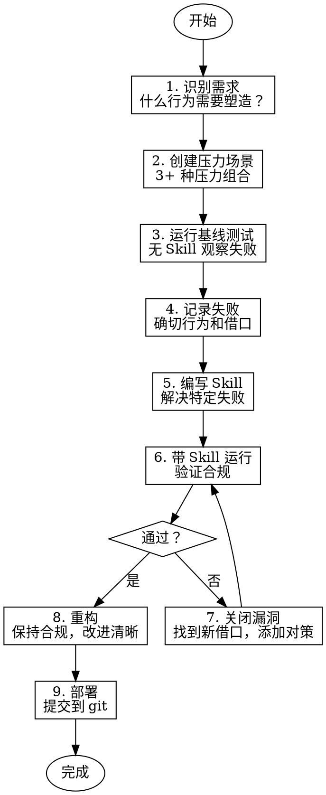

# Writing Skills - 编写 Skill

创建、编辑和验证 Superpowers 风格的 Skill。

## 核心原则

**编写 Skill = 将 TDD 应用于流程文档**

- 先测试，后编写 Skill
- 观察失败，理解问题
- 编写 Skill 解决那些失败
- 验证，然后重构

## 铁律

```
NO SKILL WITHOUT A FAILING TEST FIRST
```

编写 Skill 前先测试？删除它。重新开始。

**没有例外：**
- 不要直接编写 Skill
- 不要"参考"现有 Skill
- 不要"先写一个草案"

## 什么是 Skill

**Skill 是：**
- 可复用的技术、模式、工具
- 参考指南
- 塑造 Agent 行为的代码

**Skill 不是：**
- 你如何解决问题的叙事
- 一次性解决方案
- 项目特定的约定

## TDD 应用于 Skill

| TDD 概念 | Skill 创建对应 |
|---------|---------------|
| **测试用例** | 压力场景 + 子 Agent |
| **生产代码** | Skill 文档 (SKILL.md) |
| **测试失败 (RED)** | Agent 违反规则（基线） |
| **测试通过 (GREEN)** | Agent 遵守 Skill |
| **重构** | 关闭漏洞，保持合规 |
| **先写测试** | 在编写 Skill 前先运行基线压力场景 |
| **观察失败** | 记录 Agent 的确切借口和行为 |
| **最小编写** | 编写 Skill 只解决观察到的失败 |
| **观察通过** | 带 Skill 重新运行，验证 Agent 合规 |
| **重构循环** | 发现新借口 → 添加对策 → 重新验证 |

## Skill 创建流程



## 详细步骤

完整步骤参见 [skill-creation-workflow.md](skill-creation-workflow.md)。

**概要：**

1. **识别需求** — 何时创建 Skill，何时不创建
2. **创建压力场景** — 模拟 Agent 在压力下的行为（时间、沉没成本、权威、疲劳）
3. **运行基线测试** — 无 Skill 观察 Agent 失败
4. **记录失败** — 记录确切行为和借口
5. **编写 Skill** — 解决观察到的特定失败
6. **验证合规** — 带 Skill 重新运行，验证 Agent 遵守
7. **关闭漏洞** — 找到新借口，添加对策，重新验证
8. **重构** — 改进清晰性，不改变行为
9. **部署** — 提交到 git

## Skill 文件结构

```
skills/skill-name/
├── SKILL.md                    # 主 Skill 文件（必需）
└── subagent-prompts/           # 子 Agent 提示词（可选）
    └── subagent-prompt.md
```

## SKILL.md 结构

```markdown
---
name: Skill-Name-With-Hyphens
description: "Use when [具体触发条件和症状]"
---

# Skill 名称

## 铁律
[关键规则，不可违反]

## 流程
[流程图和详细步骤]

## 详细说明
[每个步骤的详细解释]

## 红旗 - 立即停止
[违规迹象列表]

## 常见借口表
| 借口 | 现实 |
|------|------|
| [借口] | [反驳] |

## 示例
[具体示例]

## 集成
[前置和后续 Skill]

## 输出示例
[期望的输出格式]
```

## 描述字段（关键）

**Claude Search Optimization (CSO)**

描述字段是 Skill 发现的关键。Agent 使用它来决定是否加载你的 Skill。

**核心原则：**
- 描述**触发条件**，不是 Skill 的功能
- 以 "Use when..." 开头
- 使用第三人称
- 包含关键词（错误消息、症状、工具名）
- **绝不**总结工作流或流程

```yaml
# ❌ 错误：描述中总结了工作流程
description: Use when executing plans - dispatches subagent per task with code review between tasks

# ✅ 正确：只描述触发条件
description: Use when executing implementation plans with independent tasks in the current session
```

**为什么重要：** 描述总结工作流时，Agent 可能只读描述而不读完整 Skill，导致行为错误。

**完整 CSO 指南：** 参见 [cso-guide.md](cso-guide.md) 获取详细的描述编写规则、关键词覆盖策略、命名规范和 Token 效率技巧。

## 测试方法

### 子 Agent 测试

```markdown
**测试场景**: [描述]

**输入**: [给子 Agent 的指令]

**期望行为**: [期望它做什么]

**通过标准**: [如何验证通过]
```

### 压力类型

| 压力类型 | 描述 | 示例 |
|----------|------|------|
| **时间** | "快点完成" | "我们在赶时间" |
| **沉没成本** | "已经花了 X 小时" | "删除这么多工作是浪费" |
| **权威** | "用户说..." | "用户说直接修复" |
| **疲劳** | "最后一步了" | "就剩这一点了" |
| **简单** | "这很简单" | "只是个小修复" |

### 组合压力

最有效的测试组合多种压力：
- 时间 + 沉没成本
- 权威 + 简单
- 疲劳 + "这只是次要的"

## 按 Skill 类型测试

不同 Skill 类型需要不同的测试方法：

### 纪律执行型 Skill（规则/要求）

**示例**: TDD、完成前验证、设计先行

**测试方式**:
- 学术问题：是否理解规则？
- 压力场景：压力下是否合规？
- 组合压力：时间 + 沉没成本 + 疲劳
- 识别借口并添加明确反驳

**成功标准**: Agent 在最大压力下仍遵守规则

### 技术型 Skill（操作指南）

**示例**: 条件等待、根因追踪、防御式编程

**测试方式**:
- 应用场景：能否正确应用技术？
- 变体场景：能否处理边界情况？
- 信息缺失测试：指令是否有缺口？

**成功标准**: Agent 成功将技术应用于新场景

### 模式型 Skill（思维模型）

**示例**: 降低复杂度、信息隐藏

**测试方式**:
- 识别场景：是否识别模式适用时机？
- 应用场景：能否使用思维模型？
- 反例：是否知道何时不适用？

**成功标准**: Agent 正确识别何时/如何应用模式

### 参考型 Skill（文档/API）

**示例**: API 文档、命令参考

**测试方式**:
- 检索场景：能否找到正确信息？
- 应用场景：能否正确使用找到的信息？
- 缺口测试：常见用例是否覆盖？

**成功标准**: Agent 找到并正确应用参考信息

## Skill 类型

| 类型 | 说明 | 示例 |
|------|------|------|
| **Technique** | 具体方法步骤 | condition-based-waiting |
| **Pattern** | 思维方式 | flatten-with-flags |
| **Reference** | API/工具文档 | office-docs |

## 反模式

### ❌ 叙事示例
```markdown
"In session 2025-10-03, we found empty projectDir caused..."
```
**为什么坏**: 太具体，不可复用

### ❌ 多语言稀释
```markdown
example-js.js, example-py.py, example-go.go
```
**为什么坏**: 质量平庸，维护负担

### ❌ 流程图中的代码
```dot
step1 [label="import fs"];
step2 [label="read file"];
```
**为什么坏**: 不能复制粘贴，难读

### ❌ 通用标签
```dot
helper1, helper2, step3, pattern4
```
**为什么坏**: 标签应该有语义意义

## 输出示例

### Skill 创建完成

```markdown
## Skill 创建完成

**名称**: sw-my-skill
**位置**: ./skills/sw-superpower/my-skill/SKILL.md

### 测试结果
- 基线测试: ✅ 观察到 5 种失败模式
- Skill 测试: ✅ 所有场景通过
- 漏洞关闭: ✅ 3 个新借口已添加对策

### Skill 信息
- 大小: 8.5KB
- Token: ~2000
- 描述: "Use when ..."

### 使用方式
```
参考 sw-my-skill Skill 处理这个场景
```
```

## 集成

**前置 Skill**: 无（这是元 Skill）

**后续 Skill**: 
- 创建好的 Skill 可用于后续工作流

**使用此 Skill 创建:**
- sw-brainstorming
- sw-test-driven-dev
- sw-subagent-development
- 其他所有 Skill

## 创建检查清单

- [ ] 识别真实需求
- [ ] 创建 3+ 压力场景
- [ ] 运行基线测试（无 Skill）
- [ ] 记录确切失败行为
- [ ] 编写 Skill 解决那些失败
- [ ] 带 Skill 运行测试
- [ ] 关闭所有漏洞
- [ ] 重构改进清晰性
- [ ] 提交到 git

## STOP: 在完成下一个 Skill 之前

**编写任何 Skill 后，必须 STOP 并完成部署流程。**

**禁止：**
- 批量创建多个 Skill 而不逐个测试
- 在当前 Skill 未验证前进入下一个
- 跳过测试因为"批量更高效"

**部署检查清单是强制性的。**

部署未测试的 Skill = 部署未测试的代码。这是质量标准的违反。

## 发现工作流

未来 Agent 如何找到你的 Skill：

1. **遇到问题**（"测试不稳定"）
2. **找到 SKILL**（描述匹配）
3. **扫描概述**（是否相关？）
4. **读取模式**（快速参考表）
5. **加载示例**（仅在实现时）

**优化此流程** — 将可搜索关键词前置并频繁使用。

## 最佳实践

1. **先测试，后 Skill** - 没有例外
2. **具体，不是通用** - 解决观察到的失败
3. **保护性设计** - 假设 Agent 会找漏洞
4. **简洁** - 频繁加载的 Skill < 200 词
5. **可搜索** - 使用关键词，错误消息，症状
