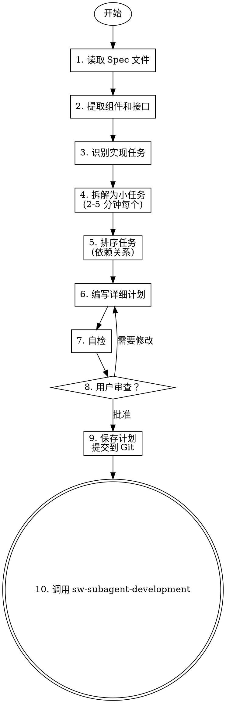

# Writing Specs - 编写实现计划

将批准的设计转化为详细的实现计划，包含可执行的小任务（每个 2-5 分钟）。

## 核心原则

**每个任务必须包含：**
- 确切的文件路径
- 完整的代码（或代码结构）
- 验证步骤

**任务大小：** 每个任务应该能在 2-5 分钟内完成。

## 何时使用


## 流程



## 详细步骤

### 1. 读取 Spec 文件

读取 `docs/sw-superpower/specs/YYYY-MM-DD--<feature>.md` 文件，理解：
- 设计概述
- 组件和接口
- 数据流
- 验收标准

### 2. 提取组件和接口

从 Spec 中提取：
- 需要创建/修改的文件
- 函数/类接口定义
- 依赖关系

### 3. 识别实现任务

基于组件识别任务类型：
- **创建文件** - 新模块、类、函数
- **修改文件** - 添加功能、修复 bug
- **编写测试** - 单元测试、集成测试
- **配置变更** - 配置文件、环境变量
- **文档更新** - README、注释

### 4. 拆解为小任务

**任务大小标准：** 每个任务 2-5 分钟

**拆解原则：**
```
❌ 大任务: "实现用户认证模块"
✅ 小任务:
  - 创建 User 模型类
  - 实现密码哈希函数
  - 实现登录验证函数
  - 编写 User 模型测试
  - 编写认证流程测试
```

### 5. 排序任务

按依赖关系排序：
1. **基础优先** - 被依赖的组件先实现
2. **测试紧随** - 实现后立即测试
3. **集成在后** - 组件完成后再集成

示例顺序：
```
1. 创建数据模型
2. 编写模型测试
3. 实现业务逻辑
4. 编写业务逻辑测试
5. 实现 API 接口
6. 编写 API 测试
7. 集成所有组件
```

### 6. 编写详细计划

每个任务必须包含：

```markdown
### 任务 N: <任务名称>

**目标**: <一句话描述>

**文件**: `<确切文件路径>`

**操作**:
```python
# 完整代码或代码结构
class User:
    def __init__(self, username: str, password: str):
        self.username = username
        self.password_hash = self._hash_password(password)
```

**验证**:
- [ ] <验证步骤 1>
- [ ] <验证步骤 2>

**依赖**: <依赖的前置任务编号>
```

### 7. 自检

完成计划后检查：

- [ ] **完整性** - 所有 Spec 中的功能都有对应任务
- [ ] **粒度** - 每个任务 2-5 分钟
- [ ] **明确性** - 每个任务有确切文件路径
- [ ] **可验证** - 每个任务有验证步骤
- [ ] **顺序合理** - 依赖关系正确
- [ ] **无遗漏** - 测试任务包含在内

### 8. 用户审查

展示计划给用户：

> "实现计划已编写完成。计划包含 N 个任务：
> - 任务 1-3: 数据模型和测试
> - 任务 4-6: 业务逻辑和测试
> - 任务 7-9: API 和集成测试
> 
> 预计总时间：X 分钟。
> 
> 请审查计划，如有调整请告知。"

### 9. 保存计划

保存到 `docs/sw-superpower/plans/YYYY-MM-DD--<feature>-plan.md`

提交到 Git：
```bash
git add docs/sw-superpower/plans/YYYY-MM-DD--<feature>-plan.md
git commit -m "docs: add implementation plan for <feature>"
```

### 10. 进入实现阶段

**唯一出口**：调用 `sw-subagent-development` Skill 执行计划。

## 任务模板

### 创建文件任务

```markdown
### 任务 N: 创建 <文件名>

**目标**: 创建 <文件描述>

**文件**: `<文件路径>`

**内容**:
```<语言>
<完整代码>
```

**验证**:
- [ ] 文件存在
- [ ] 语法正确
- [ ] 可导入/执行
```

### 修改文件任务

```markdown
### 任务 N: 在 <文件名> 中添加 <功能>

**目标**: <具体修改内容>

**文件**: `<文件路径>`

**修改**:
```<语言>
# 现有代码...（上下文）

# 新增代码
<完整新增代码>

# 现有代码...（上下文）
```

**验证**:
- [ ] 修改符合预期
- [ ] 不破坏现有功能
```

### 编写测试任务

```markdown
### 任务 N: 编写 <功能> 的测试

**目标**: 为 <功能> 编写单元测试

**文件**: `<测试文件路径>`

**测试用例**:
```python
def test_<场景>():
    """<测试描述>"""
    # Arrange
    <准备代码>
    
    # Act
    <执行代码>
    
    # Assert
    <验证代码>
```

**验证**:
- [ ] 测试可运行
- [ ] 测试先失败（RED）
- [ ] 实现后通过（GREEN）
```

## 红旗 - 停止并修正

| 想法 | 现实 |
|------|------|
| "这个任务 15 分钟也能做完" | 任务过大（> 10 分钟）= 需要拆分。大任务难以估计和验证 |
| "验证步骤可以省略" | 缺少验证步骤 = 不知道任务是否完成。每个任务必须有验证 |
| "文件路径到时候再确定" | 文件路径不明确 = 实现者迷失。必须指定确切路径 |
| "依赖关系差不多就行" | 依赖关系错误 = 阻塞或冲突。必须正确排序 |
| "测试任务后面再加" | 遗漏测试任务 = 未验证的代码。测试必须包含在计划中 |
| "任务顺序无所谓" | 任务顺序不合理 = 实现阻塞。必须按依赖关系排序 |

## 常见借口表

| 借口 | 现实 |
|------|------|
| "任务拆分太细太繁琐" | 细粒度任务提高可预测性和可验证性。大任务容易遗漏步骤 |
| "验证步骤到时候再想" | 没有验证步骤 = 无法确认任务完成。计划时必须定义 |
| "文件路径实现时再定" | 模糊的文件路径导致实现者做不必要的决策 |
| "测试可以单独一个阶段" | 测试紧随实现是 TDD 原则。分离测试 = 可能跳过 |
| "依赖关系很复杂，简化一下" | 错误的依赖关系导致实现阻塞。复杂依赖需要仔细分析 |

## YAGNI 原则

计划中只包含 Spec 明确要求的内容：
- 不要添加 Spec 未要求的功能
- 不要过度设计
- 不要假设未来需求

## 示例

### 输入 Spec（简化）

```markdown
## 用户认证

### 组件
- User 类：username, password_hash
- 登录函数：验证用户名密码

### 接口
```python
class User:
    def __init__(self, username: str, password: str)
    def verify_password(self, password: str) -> bool

def login(username: str, password: str) -> User | None
```
```

### 输出实现计划

```markdown
## 用户认证实现计划

### 任务 1: 创建 User 模型类

**目标**: 创建 User 类，包含用户名和密码哈希

**文件**: `dev/auth/models.py`

**内容**:
```python
import bcrypt

class User:
    def __init__(self, username: str, password: str):
        self.username = username
        self.password_hash = self._hash_password(password)
    
    def _hash_password(self, password: str) -> str:
        salt = bcrypt.gensalt()
        return bcrypt.hashpw(password.encode(), salt).decode()
    
    def verify_password(self, password: str) -> bool:
        return bcrypt.checkpw(
            password.encode(), 
            self.password_hash.encode()
        )
```

**验证**:
- [ ] 文件可导入
- [ ] User 类可实例化
- [ ] 密码哈希正确生成

### 任务 2: 编写 User 模型测试

**目标**: 为 User 类编写单元测试

**文件**: `dev/auth/test_models.py`

**内容**:
```python
import pytest
from auth.models import User

def test_user_creation():
    user = User("testuser", "password123")
    assert user.username == "testuser"
    assert user.password_hash is not None

def test_password_verification_success():
    user = User("testuser", "password123")
    assert user.verify_password("password123") is True

def test_password_verification_failure():
    user = User("testuser", "password123")
    assert user.verify_password("wrongpassword") is False
```

**验证**:
- [ ] 测试可运行
- [ ] 先失败（RED）
- [ ] 模型实现后通过（GREEN）

### 任务 3: 实现登录函数

**目标**: 实现登录验证逻辑

**文件**: `dev/auth/service.py`

**内容**:
```python
from auth.models import User

def login(username: str, password: str) -> User | None:
    """验证用户登录，成功返回 User，失败返回 None"""
    # 从数据库获取用户
    user_data = get_user_from_db(username)
    if not user_data:
        return None
    
    # 重建 User 对象
    user = User(username, "")  # 临时创建
    user.password_hash = user_data["password_hash"]
    
    # 验证密码
    if user.verify_password(password):
        return user
    return None

def get_user_from_db(username: str) -> dict | None:
    """从数据库获取用户数据（模拟）"""
    # TODO: 实际数据库查询
    pass
```

**验证**:
- [ ] 函数可调用
- [ ] 正确用户返回 User 对象
- [ ] 错误密码返回 None

### 任务 4: 编写登录函数测试

**目标**: 为登录函数编写测试

**文件**: `dev/auth/test_service.py`

**内容**:
```python
import pytest
from unittest.mock import patch
from auth.service import login
from auth.models import User

def test_login_success():
    with patch('auth.service.get_user_from_db') as mock_get:
        mock_get.return_value = {
            "username": "testuser",
            "password_hash": "<hashed_password>"
        }
        # TODO: 使用实际哈希值
        
        result = login("testuser", "password123")
        assert result is not None
        assert result.username == "testuser"

def test_login_wrong_password():
    with patch('auth.service.get_user_from_db') as mock_get:
        mock_get.return_value = {
            "username": "testuser", 
            "password_hash": "<hashed_password>"
        }
        
        result = login("testuser", "wrongpassword")
        assert result is None

def test_login_user_not_found():
    with patch('auth.service.get_user_from_db') as mock_get:
        mock_get.return_value = None
        
        result = login("nonexistent", "password")
        assert result is None
```

**验证**:
- [ ] 所有测试场景覆盖
- [ ] 测试先失败（RED）
- [ ] 实现后通过（GREEN）
```

## 集成

**前置 Skill**: sw-brainstorming（提供批准的 Spec）

**后续 Skill**: sw-subagent-development（执行计划）

**相关 Skill**:
- sw-test-driven-dev - 确保每个任务遵循 TDD

## 输出示例

**计划文件**: `docs/sw-superpower/plans/2026-04-08--auth-plan.md`

**返回摘要格式**：
```markdown
## 实现计划完成

**计划文件**: `docs/sw-superpower/plans/2026-04-08--auth-plan.md`
**任务数**: 8
**预计时间**: 40 分钟

### 任务概览
| 编号 | 任务 | 文件 | 依赖 |
|------|------|------|------|
| 1 | 创建 User 模型 | `dev/auth/models.py` | - |
| 2 | 编写模型测试 | `dev/auth/test_models.py` | 1 |
| 3 | 实现登录函数 | `dev/auth/service.py` | 1 |
| 4 | 编写登录测试 | `dev/auth/test_service.py` | 3 |

**下一步**: 调用 sw-subagent-development 执行计划
```
