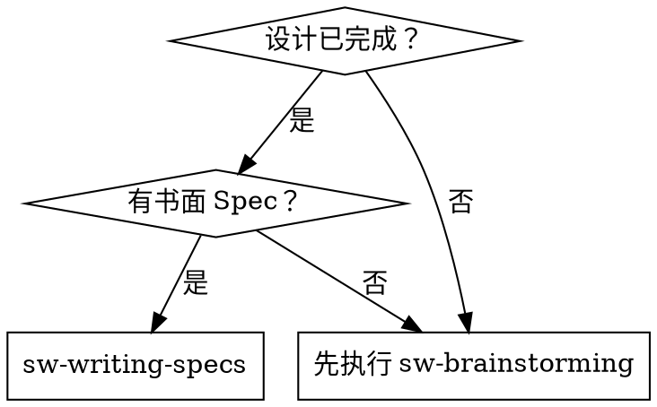
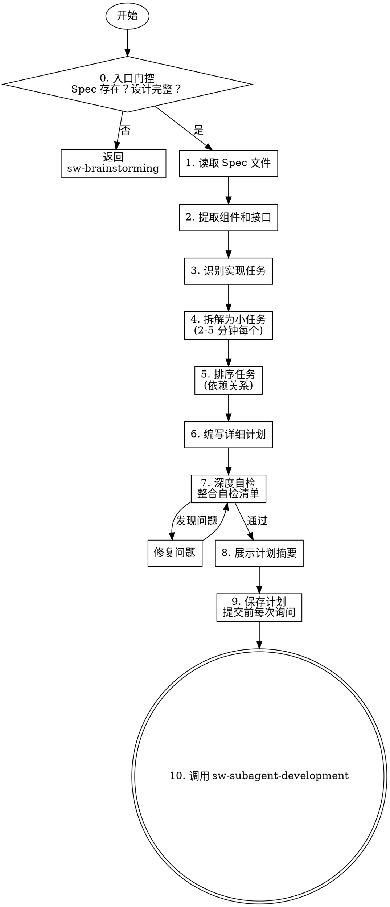

# Writing Specs - 编写实现计划

将完整的设计转化为详细的实现计划，包含可执行的小任务（每个 2-5 分钟）。

## 检查清单

- [ ] **入口门控** — 确认 Spec 文件存在且设计已完整
- [ ] **读取 Spec** — 理解设计概述、组件接口、数据流、验收标准
- [ ] **提取组件** — 列出需要创建/修改的文件和函数/类接口
- [ ] **识别任务类型** — 创建、修改、测试、配置、文档
- [ ] **拆解为小任务** — 每个任务 2-5 分钟，成对安排实现+测试任务
- [ ] **排序任务** — 按依赖关系排序，基础优先，测试紧随
- [ ] **编写详细计划** — 每个任务包含确切文件路径、完整代码、验证步骤
- [ ] **深度自检** — 执行整合自检清单：完整性、Spec 对齐、任务分解、可构建性、验收标准覆盖、粒度、明确性、可验证性、顺序合理性
- [ ] **展示计划摘要** — 向用户展示计划概览，自动保存文件
- [ ] **保存计划** — 保存到 `docs/sw-superpower/plans/`，提交 Git 前每次询问用户
- [ ] **自动调用 sw-subagent-development** — 交接计划文件路径和依赖摘要

## 核心原则

**每个任务必须包含：**
- 确切的文件路径
- 完整的代码（或代码结构）
- 验证步骤

**任务大小：** 每个任务应该能在 2-5 分钟内完成。

**TDD 集成：** 每个实现任务后必须紧跟对应的测试任务。测试验证必须包含 RED（先失败）→ GREEN（实现后通过）。

**铁律：**
- 调用 `sw-subagent-development` 开始实现前，必须完成深度自检并保存计划文件
- 严禁跳过深度自检
- 严禁忽略入口门控直接读取 Spec

## 何时使用



## 流程



## 详细步骤

### 0. 入口门控

在开始前检查：
1. **Spec 文件存在性**：`docs/sw-superpower/specs/YYYY-MM-DD--<feature>.md` 是否存在？
2. **设计已完成**：该 Spec 是否已通过 `sw-brainstorming` 的两层自检？

如果任一检查失败：
- **Spec 不存在** → 告知用户："未找到 Spec 文件。请先执行 sw-brainstorming 完成设计阶段。"
- **设计不完整** → 告知用户："设计尚未完成两层自检。请返回 sw-brainstorming 完成自检流程。"
- **两者都通过** → 继续执行第 1 步

### 1. 读取 Spec 文件

读取 `docs/sw-superpower/specs/YYYY-MM-DD--<feature>.md` 文件，理解：
- 设计概述
- 组件和接口
- 数据流
- 验收标准

### 2. 提取组件和接口

从 Spec 中提取：
- 需要创建/修改的文件
- 函数/类接口定义
- 依赖关系
- **验收标准清单** — 列出所有验收标准，作为后续覆盖检查的基准

### 3. 识别实现任务

基于组件识别任务类型：
- **创建文件** - 新模块、类、函数
- **修改文件** - 添加功能、修复 bug
- **编写测试** - 单元测试、集成测试
- **配置变更** - 配置文件、环境变量
- **文档更新** - README、注释

### 4. 拆解为小任务

**任务大小标准：** 每个任务 2-5 分钟

**TDD 成对要求：** 每个实现任务后必须紧跟对应的测试任务，不允许累积多个实现后再统一测试。

**拆解原则：**
```
❌ 大任务: "实现用户认证模块"
✅ 小任务（成对出现）:
  - 创建 User 模型类（实现）
  - 编写 User 模型测试（测试）← 依赖上一任务
  - 实现密码哈希函数（实现）
  - 编写密码哈希测试（测试）← 依赖上一任务
```

### 5. 排序任务

**成对排序原则：** 实现任务和对应的测试任务必须相邻，中间不得插入其他实现任务。

按依赖关系排序：
1. **基础优先** - 被依赖的组件先实现
2. **测试紧随** - 每个实现任务后必须紧跟其测试任务
3. **集成在后** - 组件完成后再集成

**错误排序示例**（禁止）：
```
1. 创建数据模型
2. 实现业务逻辑  ← 错误：未先测试数据模型
3. 编写模型测试
```

**正确排序示例**：
```
1. 创建数据模型
2. 编写模型测试
3. 实现业务逻辑
4. 编写业务逻辑测试
5. 实现 API 接口
6. 编写 API 测试
7. 集成所有组件
```

### 6. 编写详细计划

**统一模板（所有任务共用）：**

```markdown
### 任务 N: <任务名称>

**文件**: `<确切文件路径>`

**动作**: <一句话描述要做什么>

**详情**: <按任务类型填写，见下方分层要求>

**验证**: <如何确认完成>

**依赖**: <前置任务编号，无则留空>
```

**按任务类型区分的详细度要求：**

| 任务类型 | 详情字段要求 | 原因 |
|----------|-------------|------|
| **创建新文件** | 写完整代码或核心结构 | 实现者需要知道创建什么 |
| **修改现有文件** | 写变更描述 + 关键逻辑/函数签名 | 实现者根据描述在现有代码中定位并修改 |
| **编写测试** | 写测试场景列表（覆盖什么 case） | 测试代码由实现者按场景编写，避免 plan 阶段写大量测试代码 |

**任务配对示例**：
```
任务 1: 创建 User 模型类（创建）
任务 2: 编写 User 模型测试（测试）← 依赖任务 1
任务 3: 实现登录函数（修改）← 依赖任务 1
任务 4: 编写登录函数测试（测试）← 依赖任务 3
```

### 7. 深度自检

编写完计划后，执行以下整合自检清单。逐项确认，发现问题则修复后重新自检。

**自检清单：**

| # | 检查项 | 通过标准 |
|---|--------|----------|
| 1 | **完整性** | 无 TODO、无占位符（如 "TODO: 补充"、"后续再定"）、无空任务描述 |
| 2 | **Spec 对齐** | 计划中每个 Spec 需求都有对应任务，无重大范围蔓延或遗漏 |
| 3 | **任务分解** | 每个任务边界清晰，能在 2-5 分钟内完成 |
| 4 | **可构建性** | 工程师能按此计划执行而不卡住（文件路径明确、详情足够判断如何实现） |
| 5 | **验收标准覆盖** | Spec 中的每条验收标准都有对应的验证任务或测试任务 |
| 6 | **明确性** | 每个任务有确切的文件路径、足够的详情（创建写代码、修改写描述、测试写场景）、清晰的验证步骤 |
| 7 | **可验证性** | 每个任务的验证步骤可执行、可判断通过/失败 |
| 8 | **顺序合理性** | 依赖关系正确，实现+测试成对相邻，基础组件优先 |

**执行方式：**
- Agent 自身对照清单逐项检查，无需启动子 Agent。
- 发现任何问题 → 修复计划 → 重新运行本自检清单。
- 全部通过后，展示计划摘要并自动保存。

### 8. 展示计划摘要

深度自检通过后，向用户展示计划摘要，然后**自动保存并推进**：

> "实现计划已编写完成。计划包含 N 个任务：
> - 任务 1-3: 数据模型和测试
> - 任务 4-6: 业务逻辑和测试
> - 任务 7-9: API 和集成测试
> 
> 预计总时间：X 分钟。
> 
> 现在自动保存计划文件并进入实现阶段。"

**自动推进**：展示摘要后自动保存文件并调用 `sw-subagent-development`，无需等待用户回复。用户如有修改需求可随时打断。

**根本性异议回退**：如果用户对计划方向有**根本性异议**（如"这个方案完全不行"、"Spec 本身有问题"、"需要重新设计"），不要在本计划中反复修改。立即回退到：
- **Spec 缺陷** → 回到 `sw-brainstorming`，重新审查或修改 Spec
- **设计方向错误** → 回到 `sw-brainstorming`，重新提出方案

### 9. 保存计划

保存到 `docs/sw-superpower/plans/YYYY-MM-DD--<feature>-plan.md`

**Git 提交（铁律）**：
> **严禁一次性授权自动提交。每次 `git commit` 前都必须单独询问用户。**

提交前询问模板：
> "计划文件已保存到 `docs/sw-superpower/plans/YYYY-MM-DD--<feature>-plan.md`。
> 准备执行 `git commit`，变更摘要：新增实现计划文件。
> 是否允许提交？"

只有用户明确允许后才执行 `git add` 和 `git commit`。用户说"好的"、"可以"等模糊回应不算明确允许——必须追问："请明确回复'允许提交'或'不允许'。"

### 10. 进入实现阶段

**唯一出口**：调用 `sw-subagent-development` Skill 执行计划。

**交接内容**：
- 计划文件路径：`docs/sw-superpower/plans/YYYY-MM-DD--<feature>-plan.md`
- Spec 文件路径：`docs/sw-superpower/specs/YYYY-MM-DD--<feature>.md`
- 任务总数和依赖关系摘要

**大规模计划**：如果任务数 > 20，建议分批调用子 Agent（每批 5-10 个无依赖或同层依赖的任务），避免单个子 Agent 上下文溢出。

**失败回退**：如果子 Agent 执行失败（如任务卡住、上下文不足），回到第 6 步（编写详细计划）重新调整任务粒度或分批策略，重新执行自检清单后再次交接。

## 任务模板

### 创建文件任务

```markdown
### 任务 N: 创建 <文件名>

**文件**: `<文件路径>`

**动作**: 创建 <文件描述>

**详情**:
```<语言>
<完整代码或核心结构>
```

**验证**:
- [ ] 文件存在
- [ ] 语法正确
- [ ] 可导入/执行
```

### 修改文件任务

```markdown
### 任务 N: 在 <文件名> 中 <做什么>

**文件**: `<文件路径>`

**动作**: <具体变更描述，如：在 UserService.login() 中添加密码过期检查>

**详情**: <关键逻辑或函数签名，可选>
```<语言>
# 若变更简单（如添加一个 if 判断），写关键逻辑即可
if password_expired:
    raise PasswordExpiredError()
```

**验证**:
- [ ] 修改符合预期
- [ ] 不破坏现有功能
```

### 编写测试任务

```markdown
### 任务 N: 编写 <功能> 的测试

**文件**: `<测试文件路径>`

**动作**: 为 <功能> 编写单元测试

**详情**: <测试场景列表，不写完整测试代码>
- 场景 1: <正常情况>
- 场景 2: <边界情况>
- 场景 3: <错误情况>

**验证**:
- [ ] 测试可运行
- [ ] 测试先失败（RED）
- [ ] 实现后通过（GREEN）
```

## 红旗 - 停止并修正

| 想法 | 现实 |
|------|------|
| "这个任务 15 分钟也能做完" | 任务过大（> 10 分钟）= 需要拆分。大任务难以估计和验证 |
| "验证步骤可以省略" | 缺少验证步骤 = 不知道任务是否完成。每个任务必须有验证 |
| "文件路径到时候再确定" | 文件路径不明确 = 实现者迷失。必须指定确切路径 |
| "依赖关系差不多就行" | 依赖关系错误 = 阻塞或冲突。必须正确排序 |
| "测试任务后面再加" | 遗漏测试任务 = 未验证的代码。测试必须包含在计划中 |
| "任务顺序无所谓" | 任务顺序不合理 = 实现阻塞。必须按依赖关系排序 |
| "跳过深度自检" | 自检清单捕获 TODO/占位符/遗漏/不可执行任务。跳过 = 有缺陷的计划 |
| "自检清单遗漏验收标准覆盖" | 验收标准没对应验证任务 = Spec 目标无法验证。必须逐条对照 |
| "修复后未重新执行自检清单" | 修改可能引入新的占位符或矛盾。重新自检是铁律 |
| "修改任务必须写完整代码上下文" | 变更描述 + 关键逻辑足够让实现者定位。不需要把 plan 变成代码 diff |
| "设计不完整就开始写计划" | 不完整的设计可能方向错误。先确认入口门控 |
| "计划文件直接提交 Git" | 每次提交前必须单独询问用户。不允许一次性授权 |
| "用户会同意提交的，不用问" | 每次提交前必须单独询问。假设用户同意 = 违规 |
| "plan 里不写完整代码，实现时会出错" | 创建任务写代码，修改/测试写描述+场景，足够指导实现。完整代码在实现阶段写 |
| "TDD 只是建议，实现完再补测试也行" | 测试后置 = 测试被跳过或质量差。计划中必须实现+测试成对出现 |

## 常见借口表

| 借口 | 现实 |
|------|------|
| "任务拆分太细太繁琐" | 细粒度任务提高可预测性和可验证性。大任务容易遗漏步骤 |
| "验证步骤到时候再想" | 没有验证步骤 = 无法确认任务完成。计划时必须定义 |
| "文件路径实现时再定" | 模糊的文件路径导致实现者做不必要的决策 |
| "测试可以单独一个阶段" | 测试紧随实现是 TDD 原则。分离测试 = 可能跳过 |
| "依赖关系很复杂，简化一下" | 错误的依赖关系导致实现阻塞。复杂依赖需要仔细分析 |
| "入口门控太麻烦，直接读 Spec" | 没有 Spec 或设计不完整就写计划 = 方向错误 + 浪费轮次。门控不可跳过 |
| "自检清单太繁琐，快速过一下就行" | 整合清单同时覆盖结构缺陷（TODO/占位符）和逻辑缺陷（验收标准遗漏）。跳过 = 有漏洞 |
| "用户会同意提交的，不用问" | 每次提交前必须单独询问。假设用户同意 = 违规 |
| "plan 里不写完整代码，实现时会出错" | 创建任务写代码，修改/测试写描述+场景，足够指导实现。完整代码在实现阶段写 |

## YAGNI 原则

计划中只包含 Spec 明确要求的内容：
- 不要添加 Spec 未要求的功能
- 不要过度设计
- 不要假设未来需求

## 示例

### 输入 Spec（简化）

```markdown
## 用户认证

### 组件
- User 类：username, password_hash
- 登录函数：验证用户名密码

### 接口
```python
class User:
    def __init__(self, username: str, password: str)
    def verify_password(self, password: str) -> bool

def login(username: str, password: str) -> User | None
```
```

### 输出实现计划

```markdown
## 用户认证实现计划

### 任务 1: 创建 User 模型类

**目标**: 创建 User 类，包含用户名和密码哈希
**文件**: `dev/auth/models.py`
**内容**: `class User` 含 `__init__`, `_hash_password`, `verify_password`
**验证**: 文件可导入 / User 类可实例化 / 密码哈希正确生成

### 任务 2: 编写 User 模型测试 ← 依赖任务 1

**目标**: 为 User 类编写单元测试
**文件**: `dev/auth/test_models.py`
**内容**: `test_user_creation`, `test_password_verification_success`, `test_password_verification_failure`
**验证**: 测试可运行 / 先失败（RED）/ 实现后通过（GREEN）

### 任务 3: 实现登录函数 ← 依赖任务 1

**目标**: 实现登录验证逻辑
**文件**: `dev/auth/service.py`
**内容**: `def login` 调用 `get_user_from_db`，验证密码后返回 User 或 None
**验证**: 函数可调用 / 正确用户返回 User / 错误密码返回 None

### 任务 4: 编写登录函数测试 ← 依赖任务 3

**目标**: 为登录函数编写测试
**文件**: `dev/auth/test_service.py`
**内容**: `test_login_success`, `test_login_wrong_password`, `test_login_user_not_found`（mock 数据库）
**验证**: 所有场景覆盖 / 先失败（RED）/ 实现后通过（GREEN）
```

## 集成

**前置 Skill**: sw-brainstorming（提供完整的 Spec）

**后续 Skill**: sw-subagent-development（执行计划）

**相关 Skill**:
- sw-test-driven-dev - 确保每个任务遵循 TDD

## 输出示例

**计划文件**: `docs/sw-superpower/plans/2026-04-08--auth-plan.md`

**返回摘要格式**：
```markdown
## 实现计划完成

**计划文件**: `docs/sw-superpower/plans/2026-04-08--auth-plan.md`
**任务数**: 8
**预计时间**: 40 分钟

### 任务概览
| 编号 | 任务 | 文件 | 依赖 |
|------|------|------|------|
| 1 | 创建 User 模型 | `dev/auth/models.py` | - |
| 2 | 编写模型测试 | `dev/auth/test_models.py` | 1 |
| 3 | 实现登录函数 | `dev/auth/service.py` | 1 |
| 4 | 编写登录测试 | `dev/auth/test_service.py` | 3 |

**下一步**: 调用 sw-subagent-development 执行计划
```
